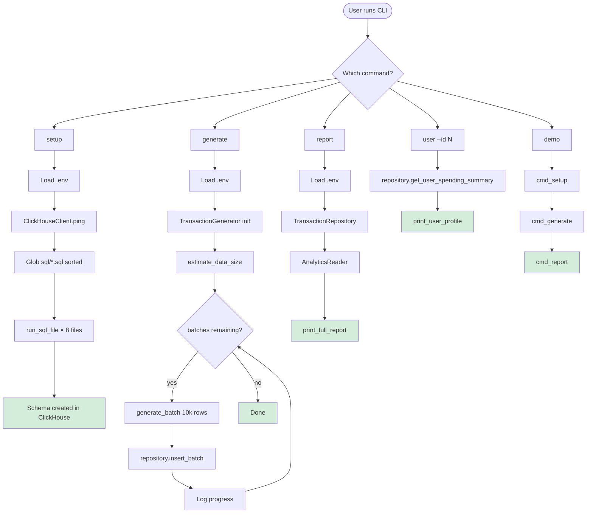
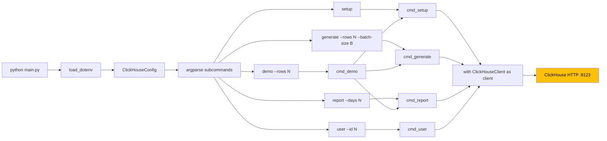
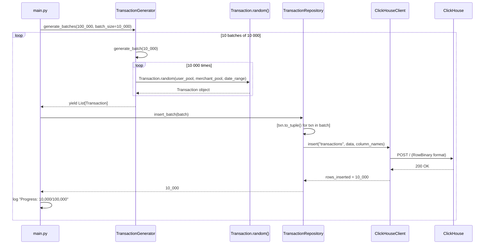
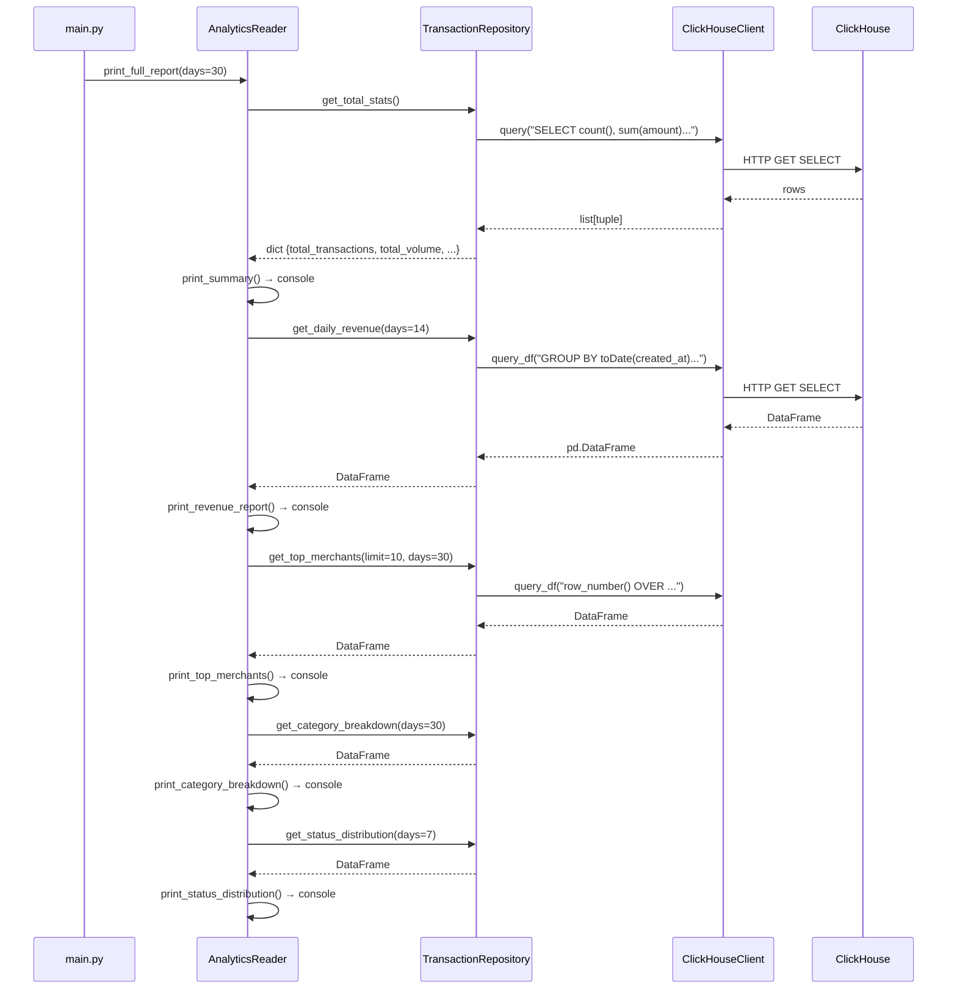
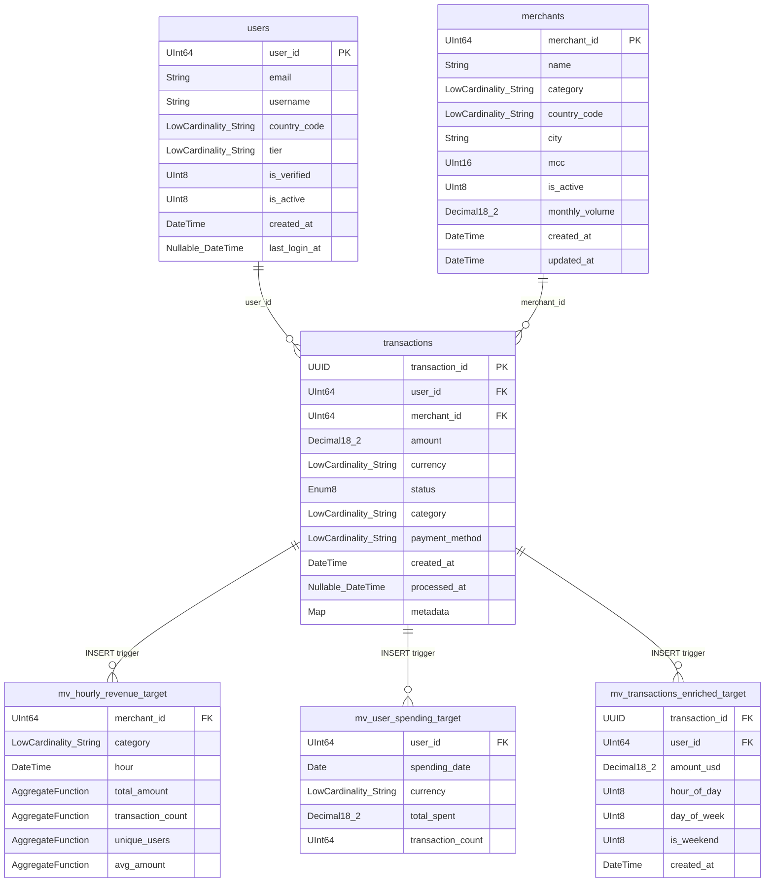
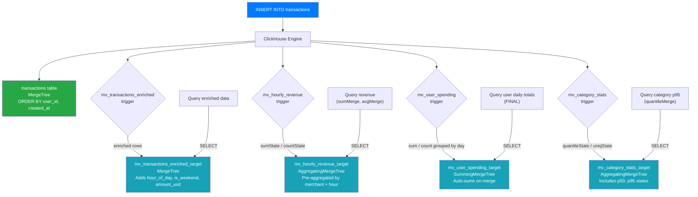
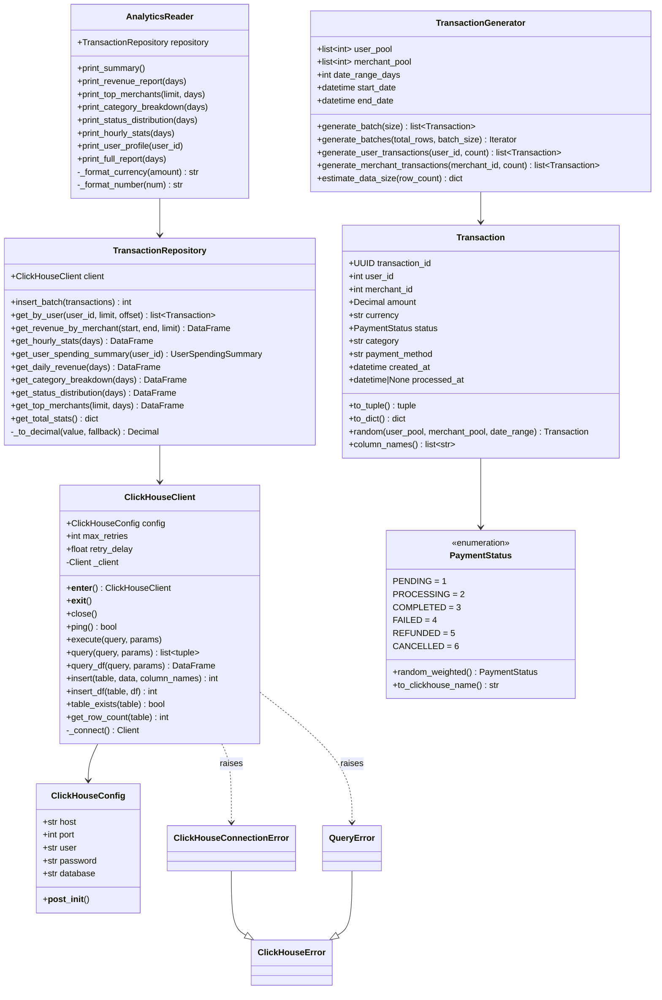
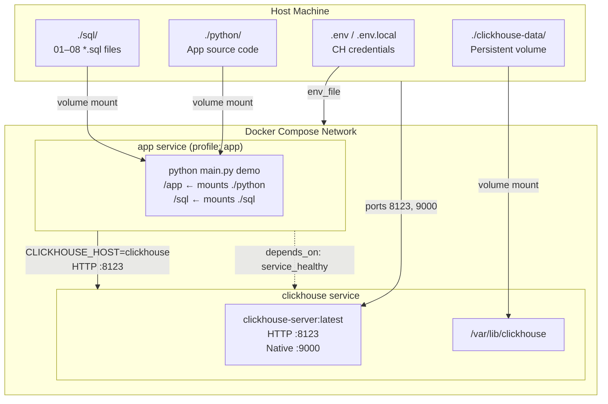
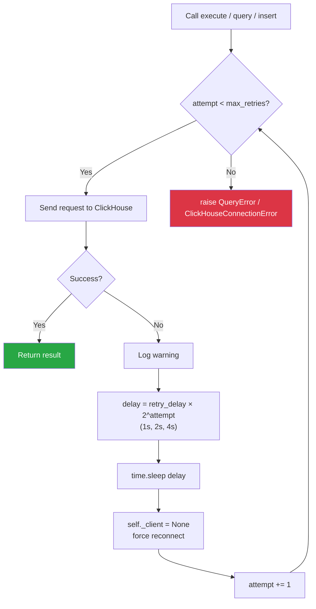

# ClickHouse Fundamentals — Codebase Explained

> A complete walkthrough of every file in the project, with workflow and data-flow diagrams.

---

## Table of Contents

1. [Project Overview](#1-project-overview)
2. [Directory Structure](#2-directory-structure)
3. [Infrastructure](#3-infrastructure)
   - [docker-compose.yml](#31-docker-composeyml)
   - [python/Dockerfile](#32-pythondockerfile)
4. [Python Application](#4-python-application)
   - [pyproject.toml](#41-pyprojecttoml)
   - [config.py](#42-configpy)
   - [main.py](#43-mainpy)
   - [db/client.py](#44-dbclientpy)
   - [db/repository.py](#45-dbrepositorypy)
   - [models/transaction.py](#46-modelstransactionpy)
   - [models/payment_metric.py](#47-modelspayment_metricpy)
   - [generators/transaction_generator.py](#48-generatorstransaction_generatorpy)
   - [readers/analytics_reader.py](#49-readersanalytics_readerpy)
5. [SQL Schema Files](#5-sql-schema-files)
   - [01_create_tables.sql](#51-01_create_tablessql)
   - [02_partitioning_and_keys.sql](#52-02_partitioning_and_keyssql)
   - [03_replacing_merge_tree.sql](#53-03_replacing_merge_treesql)
   - [04_aggregating_merge_tree.sql](#54-04_aggregating_merge_treesql)
   - [05_materialized_views.sql](#55-05_materialized_viewssql)
   - [06_projections.sql](#56-06_projectionssql)
   - [07_ttl_and_compression.sql](#57-07_ttl_and_compressionsql)
   - [08_analytical_queries.sql](#58-08_analytical_queriessql)
6. [Workflow Diagrams](#6-workflow-diagrams)
   - [Full Application Workflow](#61-full-application-workflow)
   - [CLI Command Routing](#62-cli-command-routing)
   - [Data Generation & Insertion Flow](#63-data-generation--insertion-flow)
   - [Analytics Query & Reporting Flow](#64-analytics-query--reporting-flow)
   - [ClickHouse Schema & Table Relationships](#65-clickhouse-schema--table-relationships)
   - [Materialized View Trigger Flow](#66-materialized-view-trigger-flow)
   - [Python Class Diagram](#67-python-class-diagram)
   - [Docker Deployment Architecture](#68-docker-deployment-architecture)
   - [Retry & Connection Logic](#69-retry--connection-logic)

---

## 1. Project Overview

This is a **ClickHouse learning project** covering Lessons 11 & 12 of a Data Engineering bootcamp. It simulates a payment analytics platform where:

- A **Python CLI app** generates realistic payment transaction data and runs analytics reports.
- **ClickHouse** stores and queries the data using advanced features: MergeTree engines, materialized views, projections, TTL, and compression codecs.
- **Docker Compose** orchestrates the ClickHouse server and the Python app as separate services.

The project teaches production patterns: schema design, batch inserts, repository layer, retry logic, and query optimization.

---

## 2. Directory Structure

```
clickhouse/
├── Makefile                         # Automation: setup, generate, report, demo
├── README.md                        # Project documentation
├── docker-compose.yml               # ClickHouse + app services
├── quick-setup.md                   # Multi-user setup guide
│
├── docs/                            # Conceptual notes (not code)
│   ├── 01-architecture.md
│   ├── 02-merge-tree-engines.md
│   ├── 03-advanced-engines.md
│   ├── 04-materialized-views.md
│   └── 05-query-optimization.md
│
├── sql/                             # ClickHouse DDL & examples (executed in order)
│   ├── 01_create_tables.sql
│   ├── 02_partitioning_and_keys.sql
│   ├── 03_replacing_merge_tree.sql
│   ├── 04_aggregating_merge_tree.sql
│   ├── 05_materialized_views.sql
│   ├── 06_projections.sql
│   ├── 07_ttl_and_compression.sql
│   └── 08_analytical_queries.sql
│
└── python/
    ├── Dockerfile                   # Multi-stage build
    ├── pyproject.toml               # Package config & dependencies
    ├── main.py                      # CLI entry point
    │
    ├── src/clickhouse_fundamentals/
    │   ├── config.py                # Connection settings via env vars
    │   ├── db/
    │   │   ├── client.py            # ClickHouse HTTP client wrapper
    │   │   └── repository.py        # Data access methods
    │   ├── models/
    │   │   ├── transaction.py       # Transaction dataclass + PaymentStatus enum
    │   │   └── payment_metric.py    # Analytics result models
    │   ├── generators/
    │   │   └── transaction_generator.py  # Realistic fake data
    │   └── readers/
    │       └── analytics_reader.py  # Formatted console reports
    │
    └── tests/
        ├── conftest.py
        ├── test_client.py
        ├── test_config.py
        ├── test_generator.py
        ├── test_repository.py
        └── test_transaction.py
```

---

## 3. Infrastructure

### 3.1 `docker-compose.yml`

Defines two Docker services:

**`clickhouse` service**
- Image: `clickhouse/clickhouse-server:latest` — the official ClickHouse server.
- Exposes port `8123` (HTTP API) and `9000` (native binary protocol).
- Mounts `./clickhouse-data` as a persistent volume so data survives container restarts.
- Environment variables set the user, password, and database on first startup.
- A **healthcheck** polls `http://localhost:8123/ping` every 5 seconds. The `app` service waits for this to pass before starting.

**`app` service**
- Built from `./python/Dockerfile` targeting the `runtime` stage.
- Only starts when the `app` Docker Compose profile is activated (e.g., `docker compose --profile app up`).
- Sets `CLICKHOUSE_HOST=clickhouse` so the Python app finds the database by its service name inside the Docker network.
- Mounts `./python` and `./sql` into the container — code changes are immediately reflected without rebuilding.
- Default command: `python main.py demo`.

```yaml
services:
  clickhouse:
    image: clickhouse/clickhouse-server:latest
    healthcheck:
      test: ["CMD", "wget", "--spider", "-q", "http://localhost:8123/ping"]
    ...
  app:
    depends_on:
      clickhouse:
        condition: service_healthy   # waits for /ping to respond
    profiles: [app]                  # opt-in only
```

---

### 3.2 `python/Dockerfile`

Uses a **multi-stage build** to keep the final image small and secure:

**Stage 1 — `builder`**
- Base: `python:3.11-slim`
- Creates an isolated virtualenv at `/opt/venv`.
- Copies `pyproject.toml` and `src/`, then runs `pip install .` to install all runtime dependencies into the venv.
- Build tools stay in this stage and are never copied forward.

**Stage 2 — `runtime`**
- Base: `python:3.11-slim` again (clean slate).
- Creates a non-root user `appuser` (UID 1000) for security.
- Copies only `/opt/venv` from the builder — no pip, no build tools.
- Copies the app source code and transfers ownership to `appuser`.
- Adds a healthcheck: `python -c "import clickhouse_connect"`.
- Default entrypoint: `python main.py demo`.

---

## 4. Python Application

### 4.1 `pyproject.toml`

Standard PEP 517 package configuration.

**Runtime dependencies:**
| Package | Purpose |
|---|---|
| `clickhouse-connect` | Official ClickHouse HTTP driver |
| `pandas` | DataFrames for analytics query results |
| `faker` | Generates realistic fake names/data |
| `python-dotenv` | Loads `.env` file into environment variables |
| `tabulate` | ASCII table formatting for console output |
| `pydantic` | Data validation (available for use) |

**Dev dependencies:** `ruff` (lint + format), `mypy` (type checking), `pytest` (tests).

---

### 4.2 `config.py`

**File:** `src/clickhouse_fundamentals/config.py`

A simple `@dataclass` that reads connection parameters from environment variables with safe defaults.

```python
@dataclass
class ClickHouseConfig:
    host: str     # CLICKHOUSE_HOST  (default: localhost)
    port: int     # CLICKHOUSE_PORT  (default: 8123)
    user: str     # CLICKHOUSE_USER  (default: default)
    password: str # CLICKHOUSE_PASSWORD (default: "")
    database: str # CLICKHOUSE_DATABASE (default: default)
```

`__post_init__` validates that `host` is non-empty, `port` is in the valid range 1–65535, and `database` is non-empty. This is the only place where configuration is validated — all other code just receives a `ClickHouseConfig` object.

**Why a dataclass?** The fields have defaults from environment variables evaluated lazily via `default_factory=lambda: os.getenv(...)`. This allows tests to override the environment before instantiation without monkey-patching.

---

### 4.3 `main.py`

**File:** `python/main.py`

The **CLI entry point**. Parses arguments with `argparse` and dispatches to one of five command functions.

#### Commands

| Command | Function | What it does |
|---|---|---|
| `setup` | `cmd_setup()` | Runs all `sql/*.sql` files in sorted order against ClickHouse |
| `generate` | `cmd_generate()` | Creates fake transactions and inserts them in batches |
| `report` | `cmd_report()` | Queries ClickHouse and prints formatted analytics tables |
| `user` | `cmd_user()` | Prints the spending profile for a single user ID |
| `demo` | `cmd_demo()` | Runs `setup → generate → report` sequentially |

#### `run_sql_file(client, filepath)`

A helper that reads a `.sql` file and executes each statement individually:
1. Iterates line-by-line, stripping `-- comment` lines.
2. Accumulates lines until it sees a `;` terminator.
3. Calls `client.execute(statement)` for each.
4. If a statement fails with `"already exists"` (idempotency), it logs a debug message and continues instead of aborting.

#### `cmd_setup(config)`

Opens a `ClickHouseClient` context, checks `ping()`, then calls `run_sql_file` for every `*.sql` file found in `SQL_DIR` (sorted alphabetically → numerical order 01–08).

#### `cmd_generate(config, rows, batch_size=10_000)`

1. Creates a `TransactionGenerator` with 10 000 users, 1 000 merchants, 90-day range.
2. Calls `estimate_data_size(rows)` to log the projected uncompressed/compressed size.
3. Iterates `generator.generate_batches(rows)` — a Python generator that yields lists of `Transaction` objects.
4. For each batch, calls `repository.insert_batch(batch)` and logs cumulative progress.

#### `cmd_report(config, days=30)`

Creates `TransactionRepository` and `AnalyticsReader`, then calls `reader.print_full_report(days=days)` which prints five consecutive ASCII tables.

#### `cmd_demo(config, rows=100_000)`

Sequential wrapper: calls `cmd_setup → cmd_generate → cmd_report`, returning on the first non-zero exit code.

---

### 4.4 `db/client.py`

**File:** `src/clickhouse_fundamentals/db/client.py`

A wrapper around the `clickhouse-connect` library that adds:
- **Context manager** support (`with ClickHouseClient(config) as client:`)
- **Exponential backoff retry** on every operation
- **Lazy connection** (connects on first use via `@property client`)

#### Exception hierarchy

```
ClickHouseError (base)
├── ClickHouseConnectionError  — raised when _connect() exhausts retries
└── QueryError                 — raised when execute()/query()/insert() fail
```

#### Key methods

| Method | Returns | Description |
|---|---|---|
| `_connect()` | `Client` | Attempts connection up to `max_retries` times with exponential backoff (delay × 2ⁿ). Raises `ClickHouseConnectionError` on total failure. |
| `execute(query)` | `None` | Sends a DDL/DML command via `client.command()`. Retries with reconnect on failure. |
| `query(query)` | `list[tuple]` | Runs a SELECT, returns raw rows as tuples. |
| `query_df(query)` | `pd.DataFrame` | Runs a SELECT, returns a pandas DataFrame (convenient for analytics). |
| `insert(table, data, column_names)` | `int` | Bulk-inserts a list of tuples. No retry — data integrity is caller's responsibility. |
| `insert_df(table, df)` | `int` | Bulk-inserts from a DataFrame. |
| `ping()` | `bool` | Health-check: calls `client.ping()`, returns `True/False`. |
| `table_exists(table)` | `bool` | Queries `system.tables` to check existence. |
| `get_row_count(table)` | `int` | Fast approximate count from `system.tables.total_rows`. |

#### Retry logic detail

```python
for attempt in range(self.max_retries):     # default: 3
    try:
        ...
        return
    except Exception as e:
        delay = self.retry_delay * (2 ** attempt)  # 1s, 2s, 4s
        time.sleep(delay)
        self._client = None  # force reconnect
raise QueryError(...)
```

On each retry the internal `_client` reference is cleared, forcing `_connect()` to be called again on the next attempt. This handles cases where the connection dropped mid-operation.

---

### 4.5 `db/repository.py`

**File:** `src/clickhouse_fundamentals/db/repository.py`

Implements the **Repository pattern**: a domain-focused data-access layer that hides raw SQL behind method names. All methods accept a `ClickHouseClient` injected via constructor — enabling easy mocking in tests.

#### Methods

| Method | Returns | SQL Pattern |
|---|---|---|
| `insert_batch(transactions)` | `int` | Converts `Transaction` list to tuples via `to_tuple()`, calls `client.insert()` |
| `get_by_user(user_id, limit, offset)` | `list[Transaction]` | `WHERE user_id = ?` with parameterised query; reconstructs `Transaction` objects |
| `get_revenue_by_merchant(start, end, limit)` | `DataFrame` | `GROUP BY merchant_id`, `sum/avg/min/max/uniq` aggregations, only `status='completed'` |
| `get_hourly_stats(days)` | `DataFrame` | `GROUP BY toStartOfHour(created_at)` for last N days |
| `get_user_spending_summary(user_id)` | `UserSpendingSummary` | `topK(1)(category)`, `uniq(merchant_id)` — profile aggregation |
| `get_daily_revenue(days)` | `DataFrame` | `GROUP BY toDate(created_at)` |
| `get_category_breakdown(days)` | `DataFrame` | Window function for % share: `count() * 100.0 / sum(count()) OVER ()` |
| `get_status_distribution(days)` | `DataFrame` | `GROUP BY status`, window-based percentage |
| `get_top_merchants(limit, days)` | `DataFrame` | `row_number() OVER (ORDER BY sum(amount) DESC)` for ranking |
| `get_total_stats()` | `dict` | Single aggregation row for summary dashboard |

**`_to_decimal(value, fallback)`** — a static helper that safely converts database values (which may come back as `float`, `str`, or `None`) to Python `Decimal`. Returns a fallback on `None` or conversion error, with a warning log.

**Timing:** Every method records `time.monotonic()` at start and logs the elapsed time in debug messages, making performance profiling easy.

---

### 4.6 `models/transaction.py`

**File:** `src/clickhouse_fundamentals/models/transaction.py`

Defines the core domain model that mirrors the ClickHouse `transactions` table.

#### `PaymentStatus(IntEnum)`

Maps ClickHouse `Enum8` values to Python integers:

```
PENDING=1, PROCESSING=2, COMPLETED=3, FAILED=4, REFUNDED=5, CANCELLED=6
```

`random_weighted()` picks a status with realistic probability weights (80% COMPLETED, 5% each for PENDING/FAILED, etc.) using `random.choices`.

#### `Transaction` dataclass

| Field | Type | Notes |
|---|---|---|
| `transaction_id` | `UUID` | Auto-generated by `uuid4()` |
| `user_id` | `int` | Foreign key to users |
| `merchant_id` | `int` | Foreign key to merchants |
| `amount` | `Decimal` | Always `Decimal`, never `float` |
| `currency` | `str` | One of: USD, EUR, GBP, CAD, AUD, JPY |
| `status` | `PaymentStatus` | IntEnum, validated in `__post_init__` |
| `category` | `str` | retail, groceries, restaurants, travel, etc. |
| `payment_method` | `str` | card, bank_transfer, wallet, crypto |
| `created_at` | `datetime` | Transaction timestamp |
| `processed_at` | `datetime \| None` | Set only for COMPLETED/FAILED/REFUNDED |

`__post_init__` normalises `amount` to `Decimal` and `status` from `int` or `str` if needed.

**`to_tuple()`** serialises the object to a tuple ordered to match `column_names()` — used for bulk insert.

**`Transaction.random(user_pool, merchant_pool, date_range)`** generates a single realistic transaction:
- Picks a random timestamp within the date range.
- Chooses `category` randomly, then picks an `amount` from that category's realistic range (e.g., `travel`: $50–$2000, `subscriptions`: $5–$100).
- Sets `processed_at` only if status is COMPLETED, FAILED, or REFUNDED (1–60 seconds after `created_at`).

---

### 4.7 `models/payment_metric.py`

**File:** `src/clickhouse_fundamentals/models/payment_metric.py`

Contains analytics result models. These are not stored directly — they represent query result shapes.

| Class | Type | Purpose |
|---|---|---|
| `UserSpendingSummary` | `TypedDict` | Result of `get_user_spending_summary()` — includes totals, dates, favourite category/merchant |
| `PaymentMetric` | `@dataclass` | Pre-aggregated metric from `AggregatingMergeTree` tables |
| `HourlyRevenue` | `@dataclass` | Per-hour, per-merchant revenue roll-up |
| `UserSpending` | `@dataclass` | Per-user, per-day spending snapshot |
| `CategoryStats` | `@dataclass` | Category-level stats with optional p50/p95 percentiles |
| `MerchantSummary` | `@dataclass` | Merchant analytics with `format_currency()` helper |
| `UserProfile` | `@dataclass` | User profile with computed `daily_average` property |
| `DailyRevenue` | `@dataclass` | Daily row with `to_row()` for tabulate display |

`UserSpendingSummary` is a `TypedDict` (not a dataclass) because it is returned directly as a plain `dict` from a query — the TypedDict annotation provides static type safety without needing instantiation.

---

### 4.8 `generators/transaction_generator.py`

**File:** `src/clickhouse_fundamentals/generators/transaction_generator.py`

Encapsulates all test data generation logic.

#### Constructor

```python
TransactionGenerator(
    user_count=10000,       # creates user_pool = [1, 2, ..., 10000]
    merchant_count=1000,    # creates merchant_pool = [1, ..., 1000]
    date_range_days=90,     # end_date=now(), start_date=now()-90d
    seed=None,              # optional: sets Faker.seed + random.seed for reproducibility
)
```

#### Methods

**`generate_batch(size)`** — Calls `Transaction.random(user_pool, merchant_pool, date_range)` in a loop. Catches and warns on individual failures rather than aborting the whole batch.

**`generate_batches(total_rows, batch_size=10000)`** — A Python **generator** (uses `yield`). Calculates how many full batches fit (`total_rows // batch_size`) plus a remainder, and yields each. Memory-efficient: only one batch (10 000 rows ≈ 1.2 MB) is in memory at a time.

**`generate_user_transactions(user_id, count=50)`** — Pins `user_pool=[user_id]`, forcing all generated transactions to belong to a single user. Useful for targeted testing.

**`generate_merchant_transactions(merchant_id, count=100)`** — Pins `merchant_pool=[merchant_id]`.

**`estimate_data_size(row_count)`** — Returns a dict of approximate sizes:
- ~120 bytes/row uncompressed (UUID 16B + 2×UInt64 8B + Decimal 16B + strings ~50B + 2×DateTime 8B)
- Compressed: ÷10 (pessimistic) to ÷5 (optimistic), reflecting ClickHouse's typical 5–10× compression ratio.

---

### 4.9 `readers/analytics_reader.py`

**File:** `src/clickhouse_fundamentals/readers/analytics_reader.py`

Responsible solely for **presentation** — takes data from the repository and formats it for console output using the `tabulate` library.

#### Methods

| Method | Output |
|---|---|
| `print_summary()` | Total transactions, volume, users, merchants, date range |
| `print_revenue_report(days)` | Table: date / txn count / revenue / avg txn / customers / merchants |
| `print_top_merchants(limit, days)` | Table: rank / merchant ID / txn count / revenue / avg / customers |
| `print_category_breakdown(days)` | Table: category / txns / % / revenue / % / avg txn |
| `print_status_distribution(days)` | Table: status / txns / % of total / total amount |
| `print_hourly_stats(days)` | Table: last 24 hours of hourly stats |
| `print_user_profile(user_id)` | Key-value summary for one user |
| `print_full_report(days)` | Calls all of the above in sequence |

**Formatting helpers:**
- `_format_currency(amount)` → `$1,234.56`
- `_format_number(num)` → `1,234,567`

Each method wraps its repository call in a `try/except` and prints a user-friendly error message on failure — the report continues even if one section fails.

---

## 5. SQL Schema Files

These files are executed in alphabetical (numeric) order by `cmd_setup()`. Each is idempotent: it uses `CREATE … IF NOT EXISTS` and `DROP … IF EXISTS` so re-running setup is safe.

---

### 5.1 `01_create_tables.sql`

Creates the three core tables.

**`transactions`** — Main fact table:
```sql
CREATE TABLE transactions (
    transaction_id UUID DEFAULT generateUUIDv4(),
    user_id        UInt64,
    merchant_id    UInt64,
    amount         Decimal(18, 2),         -- exact decimal for money
    currency       LowCardinality(String), -- dictionary-encoded (few unique values)
    status         Enum8('pending'=1, 'processing'=2, 'completed'=3,
                         'failed'=4, 'refunded'=5, 'cancelled'=6),
    category       LowCardinality(String),
    payment_method LowCardinality(String),
    created_at     DateTime DEFAULT now(),
    processed_at   Nullable(DateTime),
    metadata       Map(String, String)
) ENGINE = MergeTree()
PARTITION BY toYYYYMM(created_at)          -- monthly partitions
ORDER BY    (user_id, created_at, transaction_id)
PRIMARY KEY (user_id, created_at);         -- prefix of ORDER BY
```

Key design decisions:
- `LowCardinality(String)` on columns with few distinct values (currency, category, payment_method) — ClickHouse dictionary-encodes these, often 10–100× smaller.
- `Enum8` for status — validated at insert time, stored as 1 byte.
- `Decimal(18,2)` instead of `Float` for money — no floating-point rounding errors.
- `ORDER BY` leads with `user_id` so per-user queries skip entire granules.
- `PRIMARY KEY` is a prefix of `ORDER BY` — it defines what goes into the sparse index; keeping it shorter reduces index size.

**`merchants`** and **`users`** — Dimension tables with simpler `ORDER BY (merchant_id)` / `ORDER BY (user_id)`.

---

### 5.2 `02_partitioning_and_keys.sql`

Demonstrates different `PARTITION BY` strategies and explains `PRIMARY KEY` vs `ORDER BY`:

- **Partition by year** (`toYear`) — for multi-year data where yearly querying is common.
- **Partition by month** (`toYYYYMM`) — the usual choice for transactional data.
- **Partition by status** — for data where status is the primary filter dimension.
- Shows that `PRIMARY KEY` can be a strict prefix of `ORDER BY`, and explains why you'd want them to differ (smaller index → faster memory usage, more columns in sort → better range scan on secondary columns).

---

### 5.3 `03_replacing_merge_tree.sql`

Shows **deduplication** patterns with `ReplacingMergeTree`:

```sql
ENGINE = ReplacingMergeTree(updated_at)   -- version column
ORDER BY (transaction_id)
```

When ClickHouse merges parts, rows with the same `ORDER BY` key are collapsed to the one with the highest `updated_at`. Queries use `FINAL` to force immediate deduplication:

```sql
SELECT * FROM transactions_dedup FINAL WHERE ...
```

Use cases: CDC (Change Data Capture) streams, upsert simulation, event deduplication.

---

### 5.4 `04_aggregating_merge_tree.sql`

Teaches **pre-aggregation** with two engines:

**`AggregatingMergeTree`**
- Columns store intermediate aggregate *states* (`AggregateFunction(sum, Decimal(18,2))`).
- Insert uses `-State` suffix functions: `sumState(amount)`, `countState()`.
- Query uses `-Merge` suffix: `sumMerge(total_amount)`.
- Background merges combine states without loss of accuracy.
- Best for queries that always aggregate the same way.

**`SummingMergeTree`**
- Simpler: during merges it automatically sums all numeric columns for rows with the same `ORDER BY` key.
- No special insert/query syntax needed.
- Best for counters and totals where you only ever need sums.

---

### 5.5 `05_materialized_views.sql`

Implements four real-time aggregation pipelines using `MATERIALIZED VIEW`.

**Key concept:** ClickHouse MVs are **INSERT triggers**, not snapshots. Every INSERT into `transactions` automatically fires the MV and inserts transformed/aggregated rows into a target table.

| MV | Target Engine | Purpose |
|---|---|---|
| `mv_transactions_enriched` | MergeTree | Enrichment: adds `hour_of_day`, `day_of_week`, `is_weekend`, USD conversion |
| `mv_hourly_revenue` | AggregatingMergeTree | Pre-aggregates revenue per merchant/category/hour using `-State` functions |
| `mv_user_spending` | SummingMergeTree | Daily spending totals per user (only `completed`/`processing` status) |
| `mv_category_stats` | AggregatingMergeTree | Category stats with p50/p95 quantile states |

**Pattern used:** `CREATE MATERIALIZED VIEW mv TO target_table AS SELECT …` — always uses an explicit `TO` clause so the target table is managed separately (easier to backfill, inspect, and drop independently).

**Backfilling historical data:**
```sql
INSERT INTO mv_hourly_revenue_target
SELECT ... FROM transactions WHERE created_at < now();
```
MVs only process future inserts — historical data must be backfilled manually.

---

### 5.6 `06_projections.sql`

**Projections** are hidden sorted copies of a table, maintained automatically by ClickHouse. The query optimizer chooses the best projection for each query.

```sql
ALTER TABLE transactions ADD PROJECTION proj_by_merchant (
    SELECT * ORDER BY (merchant_id, created_at)
);
MATERIALIZE PROJECTION proj_by_merchant IN TABLE transactions;
```

Examples in this file:
- `proj_by_merchant` — for `WHERE merchant_id = ?` queries.
- `proj_by_category` — for `WHERE category = ?` queries.
- `proj_daily_merchant_stats` — pre-aggregated daily stats per merchant (aggregate projection).
- `proj_status_stats` — hourly stats by payment status.

Projections vs Materialized Views:
- Projections are part of the same table, selected transparently.
- MVs are separate tables, queried explicitly.

---

### 5.7 `07_ttl_and_compression.sql`

Shows **data lifecycle management** and **storage optimisation**:

**TTL (Time To Live):**
```sql
ALTER TABLE transactions
MODIFY TTL
    created_at + INTERVAL 2 YEAR DELETE,                      -- delete after 2 years
    created_at + INTERVAL 6 MONTH TO DISK 'warm',             -- move to warm storage at 6 months
    created_at + INTERVAL 1 YEAR RECOMPRESS CODEC(ZSTD(9));   -- recompress after 1 year
```

**Column-level TTL** for PII removal:
```sql
ALTER TABLE transactions
MODIFY COLUMN metadata TTL created_at + INTERVAL 90 DAY;   -- wipe PII metadata after 90 days
```

**Compression Codecs by type:**
| Column Type | Recommended Codec | Reason |
|---|---|---|
| DateTime (monotonically increasing) | `DoubleDelta + ZSTD(3)` | DoubleDelta is optimal for sequences of small deltas |
| UInt IDs | `Delta + LZ4` | Delta encodes incremental IDs efficiently |
| Decimal (amounts) | `ZSTD` | Gorilla is only for Float; LZ4 or ZSTD for Decimal |
| LowCardinality(String) | `LZ4` | Already dictionary-encoded, LZ4 is fast |
| Enum8 | `LZ4` | 1-byte values, any fast codec works |

---

### 5.8 `08_analytical_queries.sql`

Real-world analytical query patterns showcasing ClickHouse features:

1. **Partition pruning** — `WHERE created_at >= today() - 30` to skip entire monthly partitions.
2. **PREWHERE** — lightweight filter applied before reading columns: `PREWHERE status = 'completed'`.
3. **Window functions** — `ROW_NUMBER()`, `LAG()`, `SUM() OVER (PARTITION BY ...)` for ranking and trends.
4. **FINAL modifier** — forces deduplication on `ReplacingMergeTree` tables.
5. **Revenue trends** — week-over-week growth using `LAG()`.
6. **Cohort analysis** — user retention by signup month.
7. **Time-series** — rolling 7-day averages with window aggregation.
8. **Funnel analysis** — status transition rates.

---

## 6. Workflow Diagrams

### 6.1 Full Application Workflow



---

### 6.2 CLI Command Routing



---

### 6.3 Data Generation & Insertion Flow



---

### 6.4 Analytics Query & Reporting Flow



---

### 6.5 ClickHouse Schema & Table Relationships



---

### 6.6 Materialized View Trigger Flow



---

### 6.7 Python Class Diagram



---

### 6.8 Docker Deployment Architecture



---

### 6.9 Retry & Connection Logic



---

## Summary

| Layer | File(s) | Responsibility |
|---|---|---|
| **Config** | `config.py` | Read env vars, validate connection params |
| **CLI** | `main.py` | Parse args, orchestrate commands, load SQL files |
| **Transport** | `db/client.py` | HTTP connection to ClickHouse, retry logic, type conversions |
| **Data Access** | `db/repository.py` | Domain-specific SQL queries, DataFrame/dict returns |
| **Models** | `models/transaction.py`, `models/payment_metric.py` | Data shapes, serialisation, random generation |
| **Generation** | `generators/transaction_generator.py` | Realistic fake data with configurable pools and date ranges |
| **Presentation** | `readers/analytics_reader.py` | Format and print analytics reports to console |
| **Schema** | `sql/01–08_*.sql` | DDL: tables, engines, MVs, projections, TTL, example queries |
| **Infrastructure** | `docker-compose.yml`, `Dockerfile` | Container orchestration, multi-stage build, healthchecks |
