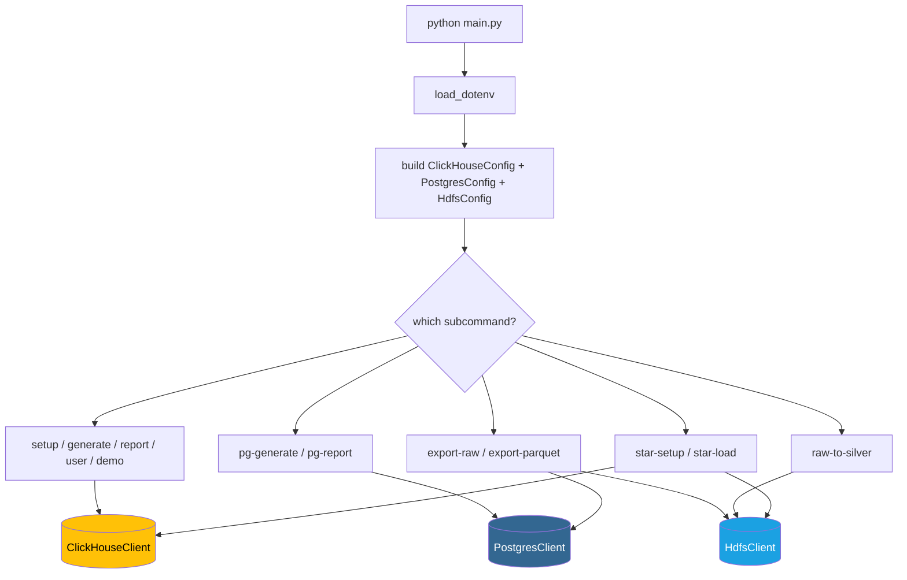
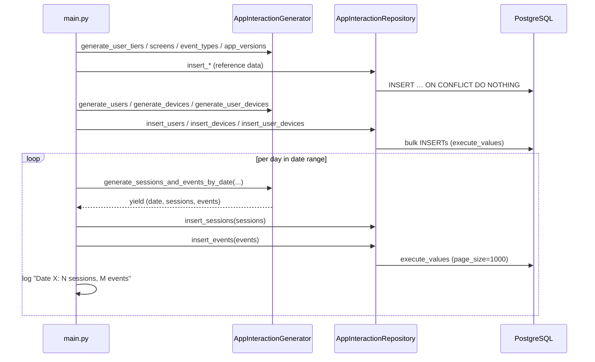
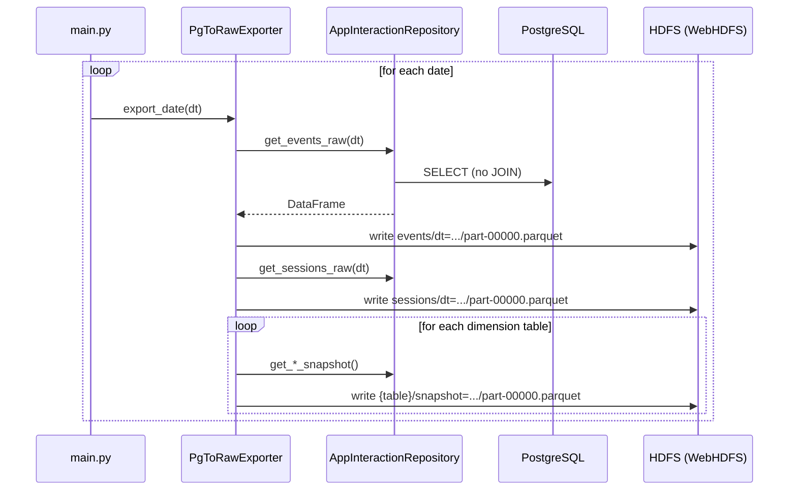
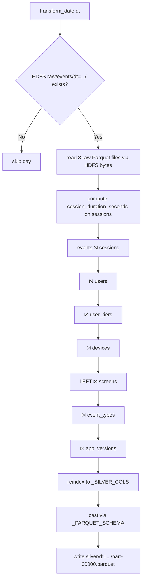
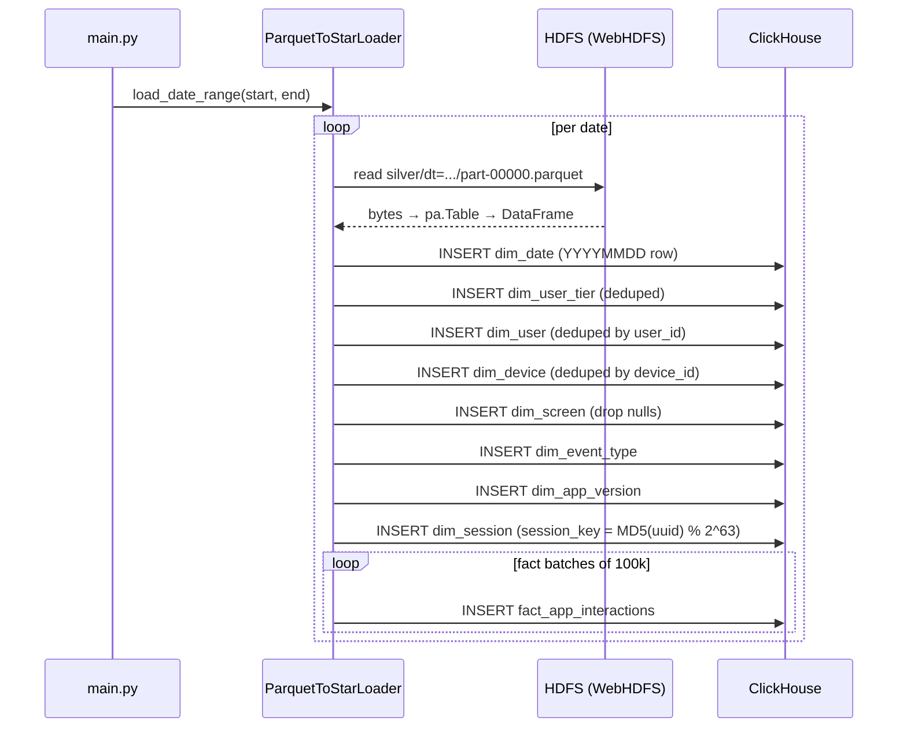
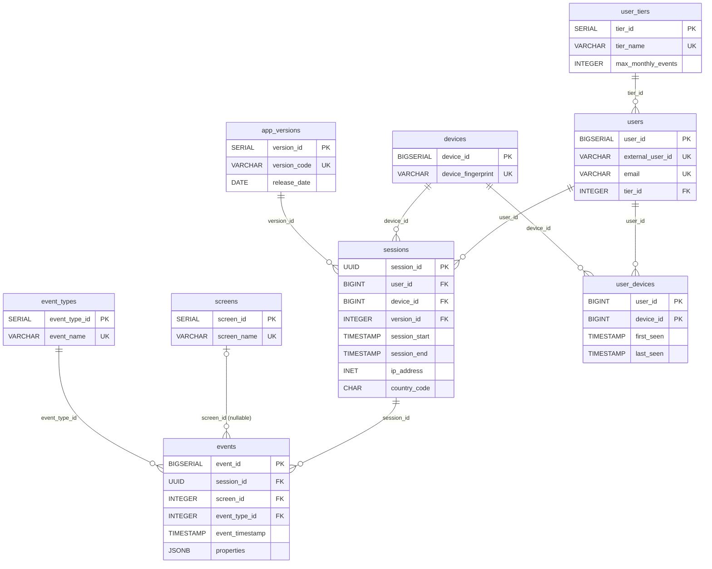
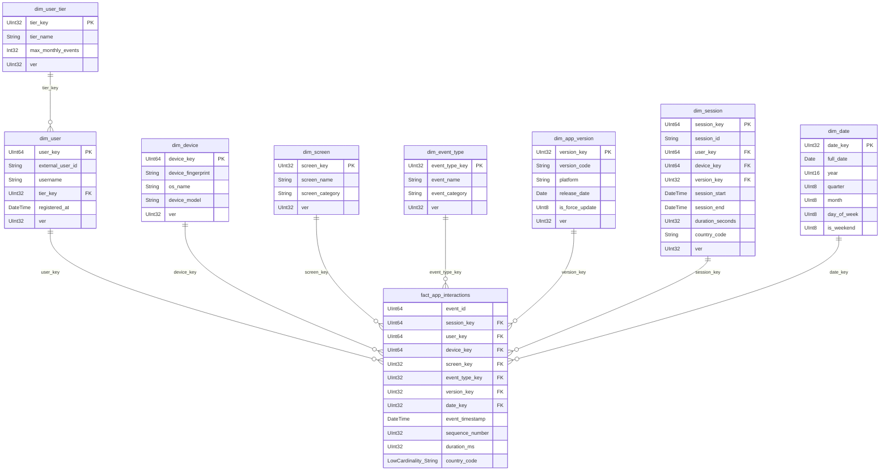
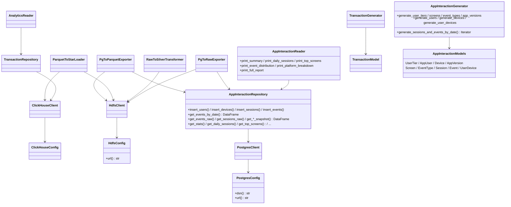
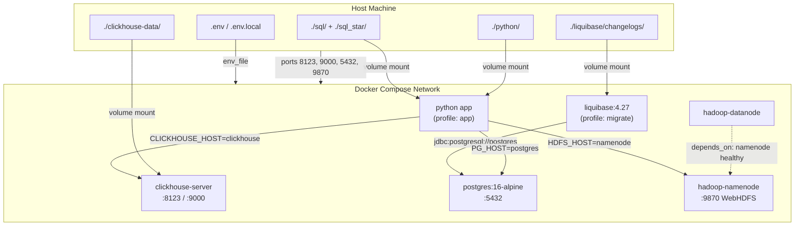

# ClickHouse Fundamentals + Mobile App Pipeline — Codebase Explained (v2)

> A complete walkthrough of every file in the project after the data-pipeline
> additions, with workflow and data-flow diagrams.

---

## Table of Contents

1. [Project Overview](#1-project-overview)
2. [Directory Structure](#2-directory-structure)
3. [Infrastructure](#3-infrastructure)
   - [docker-compose.yml](#31-docker-composeyml)
   - [python/Dockerfile](#32-pythondockerfile)
   - [hadoop-config/](#33-hadoop-config)
   - [Makefile](#34-makefile)
4. [Liquibase (PostgreSQL Migrations)](#4-liquibase-postgresql-migrations)
5. [Python Application](#5-python-application)
   - [pyproject.toml](#51-pyprojecttoml)
   - [config.py](#52-configpy)
   - [main.py](#53-mainpy)
   - [db/client.py](#54-dbclientpy)
   - [db/repository.py](#55-dbrepositorypy)
   - [db/pg_client.py](#56-dbpg_clientpy)
   - [db/pg_repository.py](#57-dbpg_repositorypy)
   - [hdfs/client.py](#58-hdfsclientpy)
   - [models/transaction.py](#59-modelstransactionpy)
   - [models/payment_metric.py](#510-modelspayment_metricpy)
   - [models/app_interaction.py](#511-modelsapp_interactionpy)
   - [generators/transaction_generator.py](#512-generatorstransaction_generatorpy)
   - [generators/app_interaction_generator.py](#513-generatorsapp_interaction_generatorpy)
   - [readers/analytics_reader.py](#514-readersanalytics_readerpy)
   - [readers/app_interaction_reader.py](#515-readersapp_interaction_readerpy)
   - [etl/pg_to_raw.py](#516-etlpg_to_rawpy)
   - [etl/raw_to_silver.py](#517-etlraw_to_silverpy)
   - [etl/parquet_to_star.py](#518-etlparquet_to_starpy)
   - [etl/pg_to_parquet.py (legacy)](#519-etlpg_to_parquetpy-legacy)
6. [SQL Schema Files](#6-sql-schema-files)
   - [sql/ — ClickHouse fundamentals (01–08)](#61-sql--clickhouse-fundamentals-0108)
   - [sql_star/ — Star Schema](#62-sql_star--star-schema)
7. [Workflow Diagrams](#7-workflow-diagrams)
   - [Full Pipeline Architecture](#71-full-pipeline-architecture)
   - [CLI Command Routing (v2)](#72-cli-command-routing-v2)
   - [pg-generate Flow](#73-pg-generate-flow)
   - [export-raw Flow](#74-export-raw-flow)
   - [raw-to-silver Flow](#75-raw-to-silver-flow)
   - [star-load Flow](#76-star-load-flow)
   - [HDFS Directory Layout](#77-hdfs-directory-layout)
   - [PostgreSQL ERD (3NF Source)](#78-postgresql-erd-3nf-source)
   - [ClickHouse Star Schema (8 dims + 1 fact)](#79-clickhouse-star-schema-8-dims--1-fact)
   - [Python Class Diagram (v2)](#710-python-class-diagram-v2)
   - [Docker Deployment Architecture (v2)](#711-docker-deployment-architecture-v2)
8. [Summary](#8-summary)

---

## 1. Project Overview

This project has grown from a single ClickHouse learning sandbox into a
**full bootcamp-grade data pipeline**. It now contains two parallel tracks
that share infrastructure and code:

1. **ClickHouse Fundamentals (original)** — payment analytics platform
   demonstrating MergeTree engines, materialized views, projections, TTL,
   and compression codecs against a single ClickHouse instance.

2. **Mobile App Interaction Pipeline (new)** — an end-to-end ELT pipeline
   that mirrors a real production data-engineering stack:

   ```
   PostgreSQL (3NF, 9 tables)
       └─► HDFS raw layer       (per-table Parquet, no JOINs)
              └─► HDFS silver layer  (denormalized 29-col flat Parquet)
                     └─► ClickHouse Star Schema (8 dims + 1 fact)
   ```

   - **PostgreSQL** is provisioned by **Liquibase** migrations and seeded with
     synthetic mobile-app interaction data (users, devices, sessions, events).
   - **HDFS** runs as a NameNode + DataNode pair. The Python app talks to it
     via the **WebHDFS REST API** on port 9870.
   - **ClickHouse** receives the final star schema (one fact + seven dimension
     tables + a date dimension) optimised for analytical queries.

The same Python package (`clickhouse_fundamentals`) hosts both tracks; the CLI
just gained eight new sub-commands.

---

## 2. Directory Structure

```
clickhouse/
├── Makefile                         # Automation: ClickHouse + PG + HDFS + ETL targets
├── README.md                        # Project documentation
├── docker-compose.yml               # ClickHouse + Postgres + Liquibase + HDFS + app
├── quick-setup.md                   # Multi-user setup guide
│
├── data-models/                     # Per-layer schema reference docs
│   ├── 00_architecture_overview.md
│   ├── 01_postgresql_source.md      # 3NF source ERD
│   ├── 02_hdfs_raw_layer.md
│   ├── 03_hdfs_silver_layer.md
│   └── 04_clickhouse_star_schema.md
│
├── docs/                            # Conceptual notes
│   ├── 01-architecture.md           # ClickHouse fundamentals
│   ├── 02-merge-tree-engines.md
│   ├── 03-advanced-engines.md
│   ├── 04-materialized-views.md
│   ├── 05-query-optimization.md
│   ├── hdfs/                        # HDFS theory (architecture, replication, …)
│   └── liquibase/                   # Liquibase theory (concepts, execution flow)
│
├── hadoop-config/                   # Mounted into the namenode/datanode containers
│   ├── core-site.xml
│   └── hdfs-site.xml
│
├── liquibase/                       # PostgreSQL schema migrations
│   ├── liquibase.properties
│   └── changelogs/
│       ├── db.changelog-master.yaml
│       ├── 001_create_user_tiers.yaml
│       ├── 002_create_users.yaml
│       ├── 003_create_devices.yaml
│       ├── 004_create_app_versions.yaml
│       ├── 005_create_screens.yaml
│       ├── 006_create_event_types.yaml
│       ├── 007_create_sessions.yaml
│       ├── 008_create_events.yaml
│       └── 009_create_user_devices.yaml
│
├── sql/                             # ClickHouse fundamentals DDL (executed in order)
│   ├── 01_create_tables.sql
│   ├── 02_partitioning_and_keys.sql
│   ├── 03_replacing_merge_tree.sql
│   ├── 04_aggregating_merge_tree.sql
│   ├── 05_materialized_views.sql
│   ├── 06_projections.sql
│   ├── 07_ttl_and_compression.sql
│   └── 08_analytical_queries.sql
│
├── sql_star/                        # ClickHouse star-schema DDL + analytical queries
│   ├── 01_dim_tables.sql
│   ├── 02_fact_table.sql
│   └── 03_star_queries.sql
│
└── python/
    ├── Dockerfile                   # Multi-stage build (unchanged structure)
    ├── pyproject.toml               # Adds psycopg2-binary, pyarrow, hdfs
    ├── main.py                      # CLI entry point — now 13 sub-commands
    │
    ├── src/clickhouse_fundamentals/
    │   ├── config.py                # ClickHouseConfig + PostgresConfig + HdfsConfig
    │   ├── db/
    │   │   ├── client.py            # ClickHouse HTTP client (unchanged)
    │   │   ├── repository.py        # Transaction repository (unchanged)
    │   │   ├── pg_client.py         # PostgreSQL psycopg2 wrapper (new)
    │   │   └── pg_repository.py     # AppInteractionRepository (new)
    │   ├── hdfs/
    │   │   └── client.py            # WebHDFS client wrapper (new)
    │   ├── models/
    │   │   ├── transaction.py
    │   │   ├── payment_metric.py
    │   │   └── app_interaction.py   # 9 dataclasses for the PG schema (new)
    │   ├── generators/
    │   │   ├── transaction_generator.py
    │   │   └── app_interaction_generator.py  # Faker-based mobile-app data (new)
    │   ├── readers/
    │   │   ├── analytics_reader.py
    │   │   └── app_interaction_reader.py     # PG analytics console reports (new)
    │   └── etl/                              # New ELT layer
    │       ├── pg_to_raw.py         # PostgreSQL → HDFS raw/ Parquet
    │       ├── raw_to_silver.py     # HDFS raw/ → HDFS silver/ (joins 8 tables)
    │       ├── parquet_to_star.py   # HDFS silver/ → ClickHouse star schema
    │       └── pg_to_parquet.py     # Legacy: PG (joined) → flat HDFS Parquet
    │
    └── tests/
        ├── conftest.py
        ├── test_client.py
        ├── test_config.py
        ├── test_generator.py
        ├── test_repository.py
        └── test_transaction.py
```

---

## 3. Infrastructure

### 3.1 `docker-compose.yml`

The compose file now defines **five** services orchestrated as a single
network (versus the original two):

| Service | Image | Profile | Purpose |
|---|---|---|---|
| `clickhouse` | `clickhouse/clickhouse-server:latest` | always | Analytical DB, `:8123` HTTP, `:9000` native |
| `postgres` | `postgres:16-alpine` | always | 3NF source database, `:5432` |
| `liquibase` | `liquibase/liquibase:4.27` | `migrate` | Runs PG migrations against the source DB once |
| `namenode` | `bde2020/hadoop-namenode:2.0.0-hadoop3.2.1-java8` | always | HDFS coordinator, `:9870` WebHDFS UI |
| `datanode` | `bde2020/hadoop-datanode:2.0.0-hadoop3.2.1-java8` | always | HDFS block storage |
| `app` | built from `./python/Dockerfile` | `app` | The Python CLI |

Healthchecks gate startup ordering:

- `app` waits for **both** `clickhouse` and `postgres` to be `service_healthy`.
- `liquibase` waits for `postgres` to be healthy, then runs `update` and exits.
- `datanode` waits for `namenode` to be healthy.

Three named volumes persist state across `docker compose down`:

- `pg-data` — PostgreSQL data directory.
- `hdfs-namenode` / `hdfs-datanode` — HDFS metadata + block files.

The `app` service receives **three sets of environment variables** (one per
backend) so the same image works for ClickHouse-only, PostgreSQL-only, or
full-pipeline commands.

### 3.2 `python/Dockerfile`

Same multi-stage build as v1 (`builder` → `runtime`, non-root `appuser`,
`HEALTHCHECK` on `import clickhouse_connect`). Two notable details:

- `ENV PYTHONPATH=/app/src` — local code mounted via the compose `volumes:`
  takes priority over the wheel installed inside the venv, so source edits
  are reflected without rebuilding.
- The same image runs every CLI sub-command — there is no separate ETL image.

### 3.3 `hadoop-config/`

Two XML files mounted into the `namenode` and `datanode` containers:

- [hadoop-config/core-site.xml](hadoop-config/core-site.xml) — sets
  `fs.defaultFS=hdfs://namenode:9000`.
- [hadoop-config/hdfs-site.xml](hadoop-config/hdfs-site.xml) — single-replica
  configuration suitable for a single-DataNode dev cluster.

These are only relevant when running the bde2020 Hadoop images outside the
default environment-variable-driven configuration; in this project the env
vars in `docker-compose.yml` (`CORE_CONF_*`, `HDFS_CONF_*`) drive the same
settings via the image's entrypoint script.

### 3.4 `Makefile`

The Makefile groups targets by section. The most-used commands are:

| Section | Target | What it does |
|---|---|---|
| Infrastructure | `up`, `down`, `wait`, `logs`, `ps` | ClickHouse-only lifecycle |
| Database | `setup`, `reset-db`, `sql` | Apply schemas / open shell |
| Local Python | `install`, `generate`, `report`, `demo` | Original ClickHouse fundamentals |
| Docker App | `build`, `run-*`, `docker-demo` | Run CLI inside the container |
| **PostgreSQL** | `pg-up`, `pg-migrate`, `pg-generate`, `pg-report`, `pg-sql` | New PG track |
| **HDFS** | `hdfs-up`, `hdfs-wait`, `hdfs-ls` | HDFS lifecycle |
| **ETL Pipeline** | `export-raw`, `raw-to-silver`, `star-setup`, `star-load`, `full-up`, `full-demo` | End-to-end pipeline |
| Development | `lint`, `format`, `typecheck`, `test`, `check` | Code quality |
| Utilities | `env`, `init-user`, `clean`, `clean-all`, `docs` | Misc |

Two important orchestration targets:

- **`make full-demo`** — clean rebuild + start all 5 services + run the
  whole `pg-generate → export-raw → raw-to-silver → star-setup → star-load`
  chain inside containers. The reference path for a from-scratch run.
- **`make init-user`** — interactive port-scanner that writes `.env.local`
  with collision-free port assignments (handy for shared bootcamp machines).

---

## 4. Liquibase (PostgreSQL Migrations)

Liquibase manages the PostgreSQL 3NF schema declaratively. Configuration
lives in [liquibase/liquibase.properties](liquibase/liquibase.properties);
the changeset tree is rooted at
[liquibase/changelogs/db.changelog-master.yaml](liquibase/changelogs/db.changelog-master.yaml),
which `include`s nine numbered changesets:

| File | Creates |
|---|---|
| `001_create_user_tiers.yaml` | `user_tiers` lookup (free / standard / premium) |
| `002_create_users.yaml` | `users` (BIGSERIAL, unique email/external_user_id, FK → tiers) |
| `003_create_devices.yaml` | `devices` (unique fingerprint) |
| `004_create_app_versions.yaml` | `app_versions` |
| `005_create_screens.yaml` | `screens` |
| `006_create_event_types.yaml` | `event_types` |
| `007_create_sessions.yaml` | `sessions` (UUID PK, FKs to user/device/version, indexes on `user_id`, `device_id`, `version_id`, `session_start`) |
| `008_create_events.yaml` | `events` (BIGSERIAL PK, FKs to session/screen/event_type, JSONB `properties`, indexes for analytics) |
| `009_create_user_devices.yaml` | composite-PK associative table |

The Liquibase service runs once via the `migrate` profile
(`docker compose --profile migrate run --rm --no-deps liquibase`) which is
exactly what `make pg-migrate` does. Subsequent runs are idempotent — the
DATABASECHANGELOG table tracks which changesets have already been applied.

Note: `duration_seconds` is intentionally absent from `sessions` — it is
always derived as `EXTRACT(EPOCH FROM session_end - session_start)`. This is
documented as a comment at the top of `007_create_sessions.yaml`.

---

## 5. Python Application

### 5.1 `pyproject.toml`

Three new runtime dependencies versus v1:

| Package | Purpose |
|---|---|
| `psycopg2-binary>=2.9` | PostgreSQL driver used by `db/pg_client.py` |
| `pyarrow>=14.0` | Parquet read/write in the ETL layer |
| `hdfs>=2.7` | WebHDFS client used by `hdfs/client.py` |

Existing deps (`clickhouse-connect`, `pandas`, `faker`, `python-dotenv`,
`tabulate`, `pydantic`) and dev tooling (`ruff`, `mypy`, `pytest`,
`pandas-stubs`, `types-tabulate`) are unchanged. `mypy` overrides silence
missing-stub warnings for `psycopg2`, `hdfs`, and `pyarrow`.

### 5.2 `config.py`

`config.py` now exports **three dataclasses**:

```python
@dataclass
class ClickHouseConfig:
    host: str = "localhost"; port: int = 8123
    user: str = "default";   password: str = ""
    database: str = "default"

@dataclass
class PostgresConfig:
    host: str = "localhost"; port: int = 5432
    user: str = "pguser";    password: str = "pgpassword"
    database: str = "appdb"
    def dsn(self) -> str: ...        # libpq DSN for psycopg2.connect()
    def url(self) -> str: ...        # postgresql:// URL form

@dataclass
class HdfsConfig:
    host: str = "localhost"; port: int = 9870  # WebHDFS REST
    user: str = "root"
    base_path: str = "/data/app_interactions"
    def url(self) -> str: ...        # http://host:port (NameNode WebHDFS)
```

All three follow the same pattern as v1: lazy `default_factory`-driven env
var resolution, `__post_init__` validation, no hidden global state.
`PostgresConfig` adds two convenience methods (`dsn`, `url`) so callers
don't have to template connection strings themselves.

### 5.3 `main.py`

The CLI now exposes **13 sub-commands** split into two groups.

**ClickHouse fundamentals (unchanged):**

| Command | What it does |
|---|---|
| `setup` | Apply `sql/*.sql` (01–08) to ClickHouse |
| `generate --rows N` | Generate fake transactions, batch-insert |
| `report --days N` | Print analytics tables |
| `user --id N` | Per-user spending profile |
| `demo` | `setup → generate → report` |

**Mobile-app pipeline (new):**

| Command | What it does |
|---|---|
| `pg-generate --users N --days D` | Build users/devices/sessions/events, write to PostgreSQL |
| `pg-report` | Console analytics from PostgreSQL |
| `export-raw --days N` (or `--date YYYY-MM-DD`) | Per-table PG → HDFS raw Parquet |
| `raw-to-silver --days N` | HDFS raw → HDFS silver (8-table JOIN) |
| `star-setup` | Run `sql_star/01_*.sql` + `02_*.sql` against ClickHouse |
| `star-load --days N` | HDFS silver Parquet → ClickHouse star schema |
| `export-parquet --days N` | **Legacy.** PG (joined SELECT) → HDFS flat Parquet |

A few implementation details worth knowing:

- **SQL search paths** — at import time, `main.py` resolves `SQL_DIR` and
  `SQL_STAR_DIR` to `/sql` and `/sql_star` if those volume-mount paths exist
  (i.e. running inside the `app` container) and otherwise falls back to
  the source-tree paths. This is why the same code runs identically inside
  and outside Docker.
- **Date arguments** — every pipeline sub-command accepts either
  `--date YYYY-MM-DD` (single day) **or** `--days N` (last N days through
  today). The two are mutually exclusive (`add_mutually_exclusive_group`).
- **`star-setup` selectivity** — it deliberately globs `0[12]_*.sql`, so it
  only runs `01_dim_tables.sql` and `02_fact_table.sql`. The third file
  (`03_star_queries.sql`) is example queries, not DDL — it is left for
  humans to run manually in `clickhouse-client`.
- **Configuration is built once** at the top of `main()`. If any
  `__post_init__` raises `ValueError`, the CLI exits 1 with a descriptive
  message before any I/O.

### 5.4 `db/client.py`

ClickHouse HTTP client. Identical to v1 — context manager, lazy connect,
exponential-backoff retry on `execute`/`query`/`insert`,
`ClickHouseError`/`ClickHouseConnectionError`/`QueryError` exception
hierarchy. See v1 docs for the full method catalogue. Used by both the
fundamentals commands **and** the new `star-setup` / `star-load` commands.

### 5.5 `db/repository.py`

`TransactionRepository` for the payments-fundamentals track. Unchanged from
v1: `insert_batch`, `get_revenue_by_merchant`, `get_hourly_stats`,
`get_user_spending_summary`, `get_top_merchants`, `get_total_stats`, etc.

### 5.6 `db/pg_client.py`

PostgreSQL connection wrapper backed by `psycopg2`.

Mirrors the design of `ClickHouseClient` — context-manager lifecycle,
`max_retries` exponential backoff, lazy connect, autocommit **off** so
inserts can be batched into transactions.

| Method | Returns | Notes |
|---|---|---|
| `_connect()` | — | Up to 3 attempts with `1s, 2s, 4s` backoff. Raises `PostgresConnectionError` on total failure. |
| `ping()` | `bool` | `SELECT 1` |
| `execute(query, params)` | `None` | DDL/DML, commits on success, rolls back on `psycopg2.Error`. |
| `execute_many(query, params_list)` | `int` | Wraps `psycopg2.extras.execute_batch` (page_size=1000). |
| `execute_values(query, params_list, template)` | `int` | High-throughput bulk insert via `psycopg2.extras.execute_values`. The repository uses this for everything. |
| `query(query, params)` | `list[tuple]` | Plain rows. |
| `query_df(query, params)` | `pd.DataFrame` | `pd.read_sql_query`. |
| `table_exists(table)` | `bool` | Looks up `information_schema.tables`. |
| `get_row_count(table)` | `int` | Approximate, from `pg_class.reltuples`. |

Three custom exceptions: `PostgresError` (base), `PostgresConnectionError`,
`PostgresQueryError`. Every commit-able call rolls back the transaction
before re-raising, so the connection is left in a clean state.

### 5.7 `db/pg_repository.py`

`AppInteractionRepository` — a thin domain-focused wrapper around
`PostgresClient` for the mobile-app schema. It has three responsibility
groups:

**Writes (used by `pg-generate`)** — eight `insert_*` methods (one per table)
that call `execute_values` with `ON CONFLICT … DO NOTHING` (or
`DO UPDATE SET last_seen = EXCLUDED.last_seen` for `user_devices`). All
inserts are idempotent, so re-running `pg-generate` is safe.

**Joined reads (used by `export-parquet`, legacy)** —
`get_events_by_date(dt)` returns the full 8-table JOIN as a DataFrame. This
includes the computed column
`EXTRACT(EPOCH FROM (session_end - session_start))::INT AS session_duration_seconds`.

**Raw / snapshot reads (used by `export-raw`)** — eight methods that return
each PG table on its own with no JOINs:

- `get_events_raw(dt)`, `get_sessions_raw(dt)` — date-filtered facts.
- `get_users_snapshot()`, `get_devices_snapshot()`, `get_user_tiers_snapshot()`,
  `get_screens_snapshot()`, `get_event_types_snapshot()`,
  `get_app_versions_snapshot()`, `get_user_devices_snapshot()` — full-table
  snapshots cast to text where psycopg2 doesn't natively map cleanly
  (UUIDs, INET, JSONB).

**Reporting reads (used by `pg-report`)** — `get_stats`, `get_daily_sessions`,
`get_top_screens`, `get_event_category_distribution`,
`get_platform_breakdown`.

### 5.8 `hdfs/client.py`

WebHDFS REST API wrapper around the `hdfs.InsecureClient` library, port 9870.

Same shape as `ClickHouseClient` and `PostgresClient`: context manager,
lazy connect, retries with exponential backoff. Because WebHDFS is
**stateless HTTP**, `__exit__` only nulls the cached client reference —
there is no socket to close.

Custom exceptions: `HdfsError`, `HdfsConnectionError`, `HdfsOperationError`.

| Method | Behaviour |
|---|---|
| `ping()` | `status("/")` — returns `False` rather than raising |
| `makedirs(path)` | Idempotent (creates intermediate parents) |
| `write(path, data, overwrite=True)` | In-memory `BytesIO` upload |
| `read(path)` | Returns the full file as `bytes` |
| `list(path)` | List directory entries |
| `exists(path)` | True/False |
| `delete(path, recursive=False)` | |
| `get_file_size(path)` | From `status[length]` |

Every method routes through `_retry(operation_name, fn)`, which catches
`hdfs.HdfsError` and retries with the same `1s/2s/4s` cadence.

### 5.9 `models/transaction.py`

Unchanged from v1: `PaymentStatus(IntEnum)` with weighted random sampling
plus the `Transaction` dataclass with `to_tuple()` / `random()` /
`column_names()` helpers.

### 5.10 `models/payment_metric.py`

Unchanged from v1: `UserSpendingSummary` (TypedDict), `PaymentMetric`,
`HourlyRevenue`, `UserSpending`, `CategoryStats`, `MerchantSummary`,
`UserProfile`, `DailyRevenue` dataclasses.

### 5.11 `models/app_interaction.py`

**Nine** new dataclasses, one per PostgreSQL table. They are pure data
holders — no behaviour beyond `__post_init__` defaults.

| Class | PG table | Notes |
|---|---|---|
| `UserTier` | `user_tiers` | `max_monthly_events = -1` ⇒ unlimited |
| `AppUser` | `users` | `external_user_id` is a UUID string |
| `Device` | `devices` | `device_fingerprint` is a deterministic MD5 |
| `AppVersion` | `app_versions` | per-platform release entries |
| `Screen` | `screens` | screen catalogue |
| `EventType` | `event_types` | event-name catalogue |
| `Session` | `sessions` | `duration_seconds` deliberately absent — derived |
| `Event` | `events` | `event_id = 0` ⇒ "not yet inserted" sentinel |
| `UserDevice` | `user_devices` | composite-PK association |

Two design comments live in the file: `country_code` belongs on `Session`
(travel context) and not on `AppUser` (home country); `Session.duration_seconds`
is never stored — always computed.

### 5.12 `generators/transaction_generator.py`

Unchanged from v1: `generate_batch`, `generate_batches`,
`generate_user_transactions`, `generate_merchant_transactions`,
`estimate_data_size`. Used only by `cmd_generate`.

### 5.13 `generators/app_interaction_generator.py`

`AppInteractionGenerator` builds a complete realistic mobile-app dataset.
Volumes for the default `user_count=5000, date_range_days=30` run:

- 3 user tiers (50 % free, 33 % standard, 17 % premium).
- 20 screens, 28 event types, 10 app versions (5 iOS + 5 Android).
- ~2000 unique devices (~1.5 per user) drawn from a fixed catalogue of 15
  device models with platform-correct OS versions and screen resolutions.
- ~90 k sessions over the date range (each user is active ~60 % of days,
  with 1–4 sessions when active).
- ~1.2 M events with realistic structure:
  - Each session opens with `app_open` and ends with `app_background`
    (or rarely `app_crash` at 0.5 % probability).
  - Mid-session events are weighted screen views (`home`, `product_list`,
    and `product_detail` dominate) followed by realistic interactions
    (e.g. `add_to_cart` after `product_detail` at 35 %).
  - `event_timestamp` is staggered through the session by `time_slice`.

Key public methods, all returning lists of model dataclasses:

- `generate_user_tiers()`, `generate_screens()`, `generate_event_types()`,
  `generate_app_versions()` — fixed reference data.
- `generate_users(tier_ids)`, `generate_devices(count)`,
  `generate_user_devices(users, devices)` — populate base entities.
- `generate_sessions_for_date(target_date, …)` /
  `generate_events_for_sessions(sessions, …)` — primitives.
- **`generate_sessions_and_events_by_date(...)`** — the streaming entry
  point used by `cmd_pg_generate`. It is a Python generator that yields
  `(date, sessions, events)` per day. Memory-efficient: only one day's
  data is in memory at once before the repository flushes it to PG.

### 5.14 `readers/analytics_reader.py`

Unchanged from v1. Used by `cmd_report` and `cmd_user`.

### 5.15 `readers/app_interaction_reader.py`

`AppInteractionReader` — formats `AppInteractionRepository` results with
`tabulate`. Each method renders one section to the console:

| Method | Source query |
|---|---|
| `print_summary()` | counts of users/devices/sessions/events + min/max dates |
| `print_daily_sessions()` | `GROUP BY DATE(session_start)` |
| `print_top_screens(limit)` | event count per screen |
| `print_event_distribution()` | event count per category, with % |
| `print_platform_breakdown()` | sessions / unique users by platform |
| `print_full_report()` | calls all of the above |

All called by `cmd_pg_report`.

### 5.16 `etl/pg_to_raw.py`

`PgToRawExporter` (used by `export-raw`) is the **first ELT step** —
PostgreSQL → HDFS raw layer.

For each date in the requested range it issues 8 SELECTs (no JOINs) and
writes 8 Parquet files. Fact tables are filtered by date; dimensions are
written as full snapshots so each day's facts have a self-contained set of
dimensions to JOIN against.

```
PostgreSQL → pd.DataFrame → pa.Table → io.BytesIO → HDFS bytes
```

Per-table PyArrow schemas are declared at module top
(`_SCHEMA_EVENTS`, `_SCHEMA_SESSIONS`, …, `_SCHEMA_APP_VERSIONS`) so
column types are deterministic regardless of pandas inference. The shared
`_build_table` helper coerces null fills, integer types, and timestamps
before `pa.Table.from_pandas(..., schema=…, safe=False)`.

HDFS path layout:

```
{HDFS_BASE_PATH}/raw/events/dt=YYYY-MM-DD/part-00000.parquet
{HDFS_BASE_PATH}/raw/sessions/dt=YYYY-MM-DD/part-00000.parquet
{HDFS_BASE_PATH}/raw/users/snapshot=YYYY-MM-DD/part-00000.parquet
{HDFS_BASE_PATH}/raw/{devices,user_tiers,screens,event_types,app_versions}/snapshot=YYYY-MM-DD/part-00000.parquet
```

Compression is **snappy**. Buffers stay in RAM — nothing touches local disk.

If a fact table is empty for a given date, the partition is skipped (no
empty file is written). Dimension snapshots are always written so the
silver layer has consistent state.

### 5.17 `etl/raw_to_silver.py`

`RawToSilverTransformer` (used by `raw-to-silver`) is the **second ELT
step** — pure-HDFS transformation, **no PostgreSQL dependency**.

For each date `dt`:

1. Reads the eight raw Parquet files for that day (facts via `dt=`, dims via
   `snapshot=`) into pandas DataFrames.
2. Computes `session_duration_seconds = (session_end - session_start).total_seconds()`
   on `sessions` to reproduce the `EXTRACT(EPOCH FROM …)` value the legacy
   exporter produced inside PostgreSQL.
3. Reproduces the original 7-table JOIN with sequential `df.merge(...)`
   calls — `events ⨝ sessions ⨝ users ⨝ user_tiers ⨝ devices ⨝ screens
   (LEFT) ⨝ event_types ⨝ app_versions`.
4. Drops join keys not in the silver output (`tier_id`, `ip_address`),
   reindexes to `_SILVER_COLS` order, casts via `_PARQUET_SCHEMA` (imported
   from `pg_to_parquet.py` to avoid duplication), and writes to:

   ```
   {HDFS_BASE_PATH}/silver/dt=YYYY-MM-DD/part-00000.parquet
   ```

The silver layer is intentionally **byte-for-byte schema-compatible** with
what the legacy `pg_to_parquet.py` would produce — so the downstream
`star-load` stage doesn't care whether a file came from the legacy path or
the new ELT path.

### 5.18 `etl/parquet_to_star.py`

`ParquetToStarLoader` (used by `star-load`) is the **third and final ELT
step** — HDFS silver Parquet → ClickHouse star schema.

The high-level flow per date:

```
HDFS bytes → io.BytesIO → pa.Table → pd.DataFrame
   → 8 dimension loads (deduplicated)
   → fact load (batched 100 k rows)
```

**Surrogate-key strategy** (chosen to be deterministic and collision-free):

- `user_key`, `device_key`, `screen_key`, `event_type_key`, `version_key` —
  copied straight from the source PG sequence ID.
- `tier_key` — derived from `tier_name` via the static map
  `{"free": 1, "standard": 2, "premium": 3}`.
- `session_key` — `int(MD5(session_id_uuid).hexdigest(), 16) % 2**63`
  (deterministic across reloads, fits in `UInt64`).
- `date_key` — `YYYYMMDD` integer (e.g. `20260429`).

**Versioning** — each `ParquetToStarLoader` instance computes
`self._ver = int(time.time())` once and tags every dimension row with that
version. Combined with `ReplacingMergeTree(ver)`, this means re-loading the
same day overwrites existing dimension rows on the next merge.

**Per-load row counts** are returned as a dict so the caller can log totals.

The fact loader (`_load_fact`) chunks `fact_app_interactions` inserts at
**100 000 rows / batch** to keep memory usage bounded for large days.

### 5.19 `etl/pg_to_parquet.py` (legacy)

`PgToParquetExporter` is the **original** PG → HDFS exporter, still wired
to `cmd_export_parquet`. It runs the full 7-table JOIN inside PostgreSQL
(`AppInteractionRepository.get_events_by_date`) and writes a single flat
Parquet file per day to:

```
{HDFS_BASE_PATH}/dt=YYYY-MM-DD/part-00000.parquet
```

Two reasons it's still in the tree:

1. The 29-column PyArrow schema (`_PARQUET_SCHEMA`) is **imported by the
   silver transformer** as the source of truth for the silver layout —
   keeping them in sync would duplicate schemas otherwise.
2. It demonstrates the "join-at-source" anti-pattern that the new
   `export-raw → raw-to-silver` split fixes: under the legacy path, every
   transformation change forces a full PG re-extract.

The "legacy" label appears in the Makefile (`make export-parquet` is
prefixed `[legacy]`) and in `data-models/00_architecture_overview.md`.

---

## 6. SQL Schema Files

### 6.1 `sql/` — ClickHouse fundamentals (01–08)

Eight files run by `cmd_setup` in numeric order. **Unchanged from v1** —
see the v1 docs for full detail. Recap:

| File | Topic |
|---|---|
| `01_create_tables.sql` | `transactions`, `users`, `merchants` (MergeTree) |
| `02_partitioning_and_keys.sql` | PARTITION BY / ORDER BY / PRIMARY KEY |
| `03_replacing_merge_tree.sql` | Deduplication via `ReplacingMergeTree(ver)` |
| `04_aggregating_merge_tree.sql` | `AggregatingMergeTree` + `SummingMergeTree` |
| `05_materialized_views.sql` | 4 real-time MVs (enriched / hourly / user / category) |
| `06_projections.sql` | Hidden sorted copies + aggregate projections |
| `07_ttl_and_compression.sql` | TTL DELETE / TO DISK / RECOMPRESS, codecs |
| `08_analytical_queries.sql` | Window functions, FINAL, PREWHERE, funnels |

### 6.2 `sql_star/` — Star Schema

Three new files used by the mobile-app pipeline.

**`01_dim_tables.sql`** creates eight dimensions:

| Table | Engine | ORDER BY |
|---|---|---|
| `dim_user_tier` | `ReplacingMergeTree(ver)` | `(tier_key)` |
| `dim_user` | `ReplacingMergeTree(ver)` | `(user_key)` |
| `dim_device` | `ReplacingMergeTree(ver)` | `(device_key)` |
| `dim_screen` | `ReplacingMergeTree(ver)` | `(screen_key)` |
| `dim_event_type` | `ReplacingMergeTree(ver)` | `(event_type_key)` |
| `dim_app_version` | `ReplacingMergeTree(ver)` | `(version_key)` |
| `dim_session` | `ReplacingMergeTree(ver)` | `(session_key)` |
| `dim_date` | `ReplacingMergeTree()` | `(date_key)` |

Design points:

- **`ReplacingMergeTree(ver)`** implements SCD Type 1 (overwrite) — the
  most recent `ver` wins after merges.
- **`ver` is a `UInt32` Unix timestamp** stamped by the loader on each load.
- Strings that repeat across rows (`tier_name`, `os_name`, `platform`,
  `screen_category`, `event_category`, `country_code`, `version_code`,
  `os_version`, `device_model`, `screen_resolution`, `device_type`,
  `username`) are `LowCardinality(String)` for compression and lookup
  speed.
- **`dim_session` is unusual** — it captures session-level attributes
  (start, end, duration, country, FK keys) once instead of repeating them
  on every event row in the fact.
- **`dim_date` uses `YYYYMMDD UInt32`** as `date_key`. It is sortable,
  human-readable, and JOIN-friendly.

**`02_fact_table.sql`** creates the single fact table:

```sql
CREATE TABLE fact_app_interactions (
    event_id        UInt64,
    session_key     UInt64,
    user_key        UInt64,
    device_key      UInt64,
    screen_key      UInt32,
    event_type_key  UInt32,
    version_key     UInt32,
    date_key        UInt32,         -- YYYYMMDD
    event_timestamp DateTime,
    sequence_number UInt32,
    duration_ms     UInt32,
    country_code    LowCardinality(String)  -- degenerate dimension
) ENGINE = MergeTree()
PARTITION BY toYYYYMM(event_timestamp)
ORDER BY    (user_key, event_timestamp, event_id)
PRIMARY KEY (user_key, event_timestamp);
```

Notable choices:

- **Grain** is one row per event (the finest possible).
- `country_code` is kept as a **degenerate dimension** in the fact (it's a
  frequent filter, so avoiding the JOIN is worth the per-row cost given
  `LowCardinality`).
- `platform` is **not** in the fact — query via `dim_app_version` JOIN,
  which keeps the fact narrower.

**`03_star_queries.sql`** is a catalogue of example analytical queries
**not run by `star-setup`**. It includes DAU by platform, top screens by
duration, purchase funnel conversion, OS-by-event-category breakdown,
weekly retention cohorts, version adoption, tier engagement, and a
country/hour-of-day/day-of-week heatmap. Run them by hand with
`make sql` (ClickHouse client).

---

## 7. Workflow Diagrams

### 7.1 Full Pipeline Architecture

```mermaid
flowchart LR
    subgraph PG["PostgreSQL (3NF source — 9 tables)"]
        T1[user_tiers]
        T2[users]
        T3[devices]
        T4[app_versions]
        T5[screens]
        T6[event_types]
        T7[sessions]
        T8[events]
        T9[user_devices]
    end

    subgraph HDFS_RAW["HDFS raw/ layer"]
        R1["events/dt=YYYY-MM-DD/"]
        R2["sessions/dt=YYYY-MM-DD/"]
        R3["users,devices,user_tiers,screens,event_types,app_versions/snapshot=YYYY-MM-DD/"]
    end

    subgraph HDFS_SILVER["HDFS silver/ layer"]
        S1["dt=YYYY-MM-DD/part-00000.parquet (29 cols)"]
    end

    subgraph CH["ClickHouse Star Schema"]
        D1["8 dimensions (ReplacingMergeTree)"]
        F1["fact_app_interactions (MergeTree)"]
    end

    PG -->|"export-raw"| HDFS_RAW
    HDFS_RAW -->|"raw-to-silver (8-table JOIN)"| HDFS_SILVER
    HDFS_SILVER -->|"star-load (dims + fact)"| CH

    PG -.->|"export-parquet [legacy]"| HDFS_SILVER
```



### 7.2 CLI Command Routing (v2)



### 7.3 pg-generate Flow



### 7.4 export-raw Flow



### 7.5 raw-to-silver Flow



### 7.6 star-load Flow



### 7.7 HDFS Directory Layout

```text
{HDFS_BASE_PATH=/data/app_interactions}/
├── raw/                                  ← per-table, no JOINs
│   ├── events/        dt=2026-04-30/part-00000.parquet
│   ├── sessions/      dt=2026-04-30/part-00000.parquet
│   ├── users/         snapshot=2026-04-30/part-00000.parquet
│   ├── devices/       snapshot=2026-04-30/part-00000.parquet
│   ├── user_tiers/    snapshot=2026-04-30/part-00000.parquet
│   ├── screens/       snapshot=2026-04-30/part-00000.parquet
│   ├── event_types/   snapshot=2026-04-30/part-00000.parquet
│   └── app_versions/  snapshot=2026-04-30/part-00000.parquet
│
├── silver/                               ← denormalized 29-col flat
│   └── dt=2026-04-30/part-00000.parquet
│
└── dt=2026-04-30/part-00000.parquet      ← legacy export-parquet output
```

### 7.8 PostgreSQL ERD (3NF Source)



### 7.9 ClickHouse Star Schema (8 dims + 1 fact)



### 7.10 Python Class Diagram (v2)



### 7.11 Docker Deployment Architecture (v2)



---

## 8. Summary

| Layer | File(s) | Responsibility |
|---|---|---|
| **Config** | `config.py` | `ClickHouseConfig` / `PostgresConfig` / `HdfsConfig` — env-driven |
| **CLI** | `main.py` | 13 sub-commands, two SQL search paths, mutually-exclusive date args |
| **ClickHouse transport** | `db/client.py` | HTTP, retry/backoff, pandas/insert helpers |
| **ClickHouse data access** | `db/repository.py` | Payments fundamentals queries (unchanged) |
| **PostgreSQL transport** | `db/pg_client.py` | psycopg2 wrapper, `execute_values`, autocommit off |
| **PostgreSQL data access** | `db/pg_repository.py` | Mobile-app schema reads/writes; per-table raw + joined queries |
| **HDFS transport** | `hdfs/client.py` | WebHDFS REST, retries, in-memory `BytesIO` I/O |
| **Models — payments** | `models/transaction.py`, `payment_metric.py` | unchanged |
| **Models — mobile app** | `models/app_interaction.py` | 9 dataclasses mirroring the PG 3NF tables |
| **Generators** | `generators/transaction_generator.py`, `app_interaction_generator.py` | Realistic synthetic data with weighted distributions |
| **Readers** | `readers/analytics_reader.py`, `app_interaction_reader.py` | Tabulated console reports per backend |
| **ETL** | `etl/pg_to_raw.py`, `etl/raw_to_silver.py`, `etl/parquet_to_star.py`, `etl/pg_to_parquet.py` (legacy) | Three-stage ELT: PG → raw → silver → ClickHouse |
| **Schema — ClickHouse fundamentals** | `sql/01..08_*.sql` | DDL + analytics examples for the original track |
| **Schema — Star** | `sql_star/01_dim_tables.sql`, `02_fact_table.sql` | 8 dims + 1 fact (run by `star-setup`) |
| **Queries — Star** | `sql_star/03_star_queries.sql` | DAU, funnel, retention, version adoption (manual) |
| **Schema — PostgreSQL** | `liquibase/changelogs/001..009_*.yaml` | Liquibase migrations for the 9 source tables |
| **Hadoop config** | `hadoop-config/core-site.xml`, `hdfs-site.xml` | Optional XML mounts for the bde2020 images |
| **Infrastructure** | `docker-compose.yml`, `python/Dockerfile`, `Makefile` | 5 services, multi-stage build, end-to-end orchestration |
| **Docs** | `data-models/`, `docs/`, `quick-setup.md` | Architecture diagrams, layer reference, conceptual notes |
