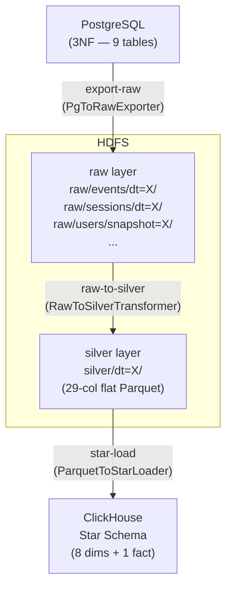

# Pipeline Architecture Overview

## End-to-End Data Flow



## Why Three Layers?

| Layer | What it stores | Who writes it | Who reads it |
|---|---|---|---|
| **Raw** | Faithful mirror of each PG table, no JOINs | `export-raw` | `raw-to-silver` |
| **Silver** | Denormalized flat table (one row per event) | `raw-to-silver` | `star-load` |
| **Gold** (ClickHouse) | Star schema optimised for analytics | `star-load` | Analysts / BI tools |

The separation means: if your transformation logic changes, you replay `raw-to-silver` without touching PostgreSQL. If your star schema changes, you replay `star-load` without re-extracting anything.

## CLI Command Map

| Command | Module | Input | Output layer |
|---|---|---|---|
| `pg-generate` | `generators/app_interaction_generator.py` | synthetic data | PostgreSQL |
| `pg-report` | `readers/app_interaction_reader.py` | PostgreSQL | console |
| `export-raw` | `etl/pg_to_raw.py` | PostgreSQL | HDFS raw/ |
| `raw-to-silver` | `etl/raw_to_silver.py` | HDFS raw/ | HDFS silver/ |
| `star-setup` | `sql_star/01_dim_tables.sql` + `02_fact_table.sql` | — | ClickHouse DDL |
| `star-load` | `etl/parquet_to_star.py` | HDFS silver/ | ClickHouse |
| `export-parquet` | `etl/pg_to_parquet.py` *(legacy)* | PostgreSQL (JOIN) | HDFS flat/ |

## HDFS Directory Structure

```
{HDFS_BASE_PATH}/
├── raw/
│   ├── events/
│   │   └── dt=2026-04-30/
│   │       └── part-00000.parquet
│   ├── sessions/
│   │   └── dt=2026-04-30/
│   │       └── part-00000.parquet
│   ├── users/
│   │   └── snapshot=2026-04-30/
│   │       └── part-00000.parquet
│   ├── devices/
│   │   └── snapshot=2026-04-30/
│   ├── user_tiers/
│   │   └── snapshot=2026-04-30/
│   ├── screens/
│   │   └── snapshot=2026-04-30/
│   ├── event_types/
│   │   └── snapshot=2026-04-30/
│   └── app_versions/
│       └── snapshot=2026-04-30/
└── silver/
    └── dt=2026-04-30/
        └── part-00000.parquet
```

Fact tables use `dt=` (date-based incremental). Dimension tables use `snapshot=` (full daily snapshot — dimensions rarely change but must be consistent with the facts of the same day).
