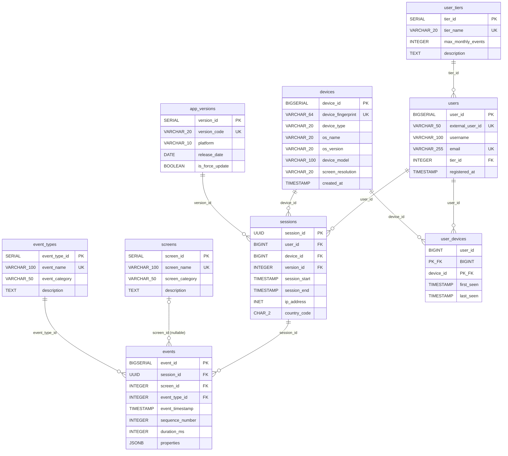

# PostgreSQL Source Schema (3NF)

The source database models a mobile app's interaction data in Third Normal Form (3NF). Each concept lives in its own table; no derived or repeated data is stored.

## ERD

## Table Reference

### user_tiers
| Column | Type | Constraints |
|---|---|---|
| tier_id | SERIAL | PK |
| tier_name | VARCHAR(20) | NOT NULL, UNIQUE |
| max_monthly_events | INTEGER | nullable (-1 = unlimited) |
| description | TEXT | nullable |

### users
| Column | Type | Constraints |
|---|---|---|
| user_id | BIGSERIAL | PK |
| external_user_id | VARCHAR(50) | NOT NULL, UNIQUE |
| username | VARCHAR(100) | NOT NULL |
| email | VARCHAR(255) | NOT NULL, UNIQUE |
| tier_id | INTEGER | NOT NULL, FK → user_tiers |
| registered_at | TIMESTAMP | DEFAULT NOW() |

### devices
| Column | Type | Constraints |
|---|---|---|
| device_id | BIGSERIAL | PK |
| device_fingerprint | VARCHAR(64) | NOT NULL, UNIQUE |
| device_type | VARCHAR(20) | NOT NULL |
| os_name | VARCHAR(20) | NOT NULL |
| os_version | VARCHAR(20) | NOT NULL |
| device_model | VARCHAR(100) | nullable |
| screen_resolution | VARCHAR(20) | nullable |
| created_at | TIMESTAMP | DEFAULT NOW() |

### app_versions
| Column | Type | Constraints |
|---|---|---|
| version_id | SERIAL | PK |
| version_code | VARCHAR(20) | NOT NULL, UNIQUE |
| platform | VARCHAR(10) | NOT NULL |
| release_date | DATE | NOT NULL |
| is_force_update | BOOLEAN | DEFAULT false |

### screens
| Column | Type | Constraints |
|---|---|---|
| screen_id | SERIAL | PK |
| screen_name | VARCHAR(100) | NOT NULL, UNIQUE |
| screen_category | VARCHAR(50) | nullable |
| description | TEXT | nullable |

### event_types
| Column | Type | Constraints |
|---|---|---|
| event_type_id | SERIAL | PK |
| event_name | VARCHAR(100) | NOT NULL, UNIQUE |
| event_category | VARCHAR(50) | nullable |
| description | TEXT | nullable |

### sessions
| Column | Type | Constraints |
|---|---|---|
| session_id | UUID | PK, DEFAULT gen_random_uuid() |
| user_id | BIGINT | NOT NULL, FK → users |
| device_id | BIGINT | NOT NULL, FK → devices |
| version_id | INTEGER | NOT NULL, FK → app_versions |
| session_start | TIMESTAMP | NOT NULL |
| session_end | TIMESTAMP | nullable |
| ip_address | INET | nullable |
| country_code | CHAR(2) | nullable |

Indexes: `user_id`, `device_id`, `version_id`, `session_start`

### events
| Column | Type | Constraints |
|---|---|---|
| event_id | BIGSERIAL | PK |
| session_id | UUID | NOT NULL, FK → sessions |
| screen_id | INTEGER | nullable, FK → screens |
| event_type_id | INTEGER | NOT NULL, FK → event_types |
| event_timestamp | TIMESTAMP | NOT NULL |
| sequence_number | INTEGER | nullable |
| duration_ms | INTEGER | nullable |
| properties | JSONB | DEFAULT '{}' |

Indexes: `session_id`, `event_timestamp`, `event_type_id`, `screen_id`

### user_devices
| Column | Type | Constraints |
|---|---|---|
| user_id | BIGINT | PK (composite), FK → users |
| device_id | BIGINT | PK (composite), FK → devices |
| first_seen | TIMESTAMP | NOT NULL |
| last_seen | TIMESTAMP | NOT NULL |
