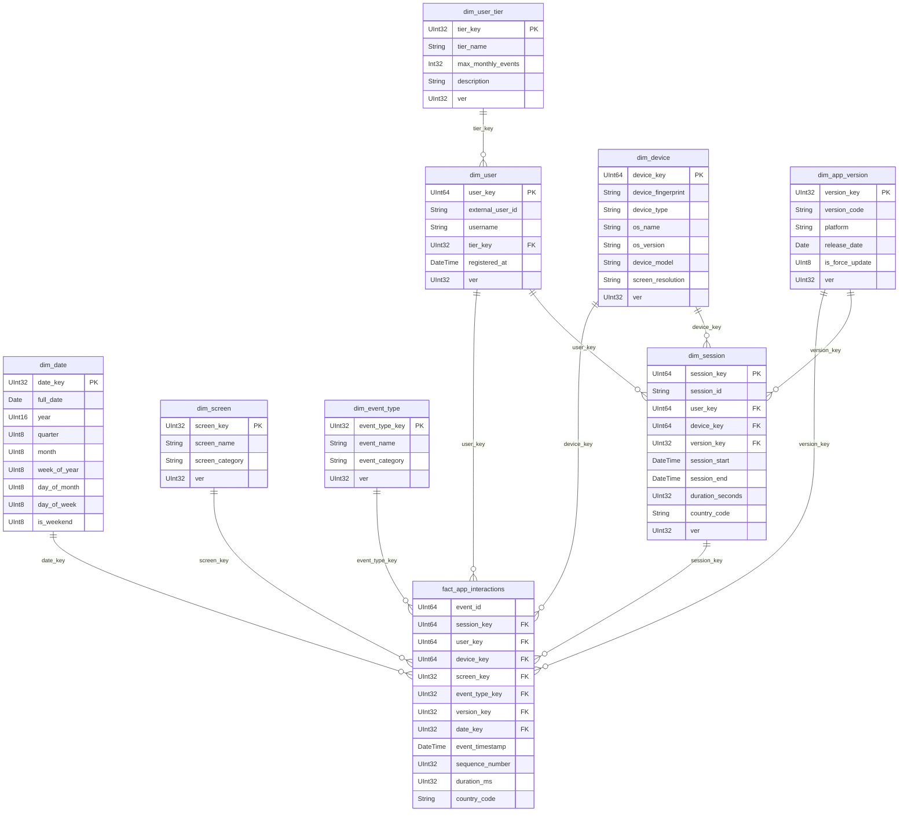

# ClickHouse Star Schema

The gold layer is a star schema optimised for fast analytical queries. It is loaded by `star-load` via `etl/parquet_to_star.py` reading from the HDFS silver layer.

## ERD

## Surrogate Key Strategy

| Star key | Derived from | Derivation method | Truly surrogate? |
|---|---|---|---|
| `user_key` | `users.user_id` (BIGSERIAL) | direct copy | No — natural PG key |
| `device_key` | `devices.device_id` (BIGSERIAL) | direct copy | No — natural PG key |
| `screen_key` | `screens.screen_id` (SERIAL) | direct copy; 0 when NULL | No — natural PG key |
| `event_type_key` | `event_types.event_type_id` (SERIAL) | direct copy | No — natural PG key |
| `version_key` | `app_versions.version_id` (SERIAL) | direct copy | No — natural PG key |
| `tier_key` | `user_tiers.tier_name` | hardcoded map (free=1, standard=2, premium=3) | Partial — NOT PG's tier_id |
| `session_key` | `sessions.session_id` (UUID) | `MD5(uuid_str) % 2^63` | Yes — UUID has no integer form |
| `date_key` | event date | YYYYMMDD integer (e.g. 20260430) | Yes — not stored in PG |

**Note:** Most keys reuse PostgreSQL SERIAL/BIGSERIAL IDs directly. This is safe for a single-source pipeline but would need true independent sequences if merging data from multiple PostgreSQL instances.

## Dimension Table Reference

### dim_date
Engine: `ReplacingMergeTree()` — no `ver` column (dates are immutable)
Order by: `(date_key)`

| Column | Type | Note |
|---|---|---|
| date_key | UInt32 | YYYYMMDD format |
| full_date | Date | |
| year | UInt16 | |
| quarter | UInt8 | 1–4 |
| month | UInt8 | 1–12 |
| week_of_year | UInt8 | ISO week |
| day_of_month | UInt8 | 1–31 |
| day_of_week | UInt8 | 1=Mon, 7=Sun (ISO 8601) |
| is_weekend | UInt8 | 1 if Sat or Sun |

### dim_user_tier
Engine: `ReplacingMergeTree(ver)` — SCD Type 1 (overwrite on re-load)

| Column | Type | Note |
|---|---|---|
| tier_key | UInt32 | hardcoded: free=1, standard=2, premium=3 |
| tier_name | LowCardinality(String) | |
| max_monthly_events | Int32 | -1 = unlimited |
| description | String | |
| ver | UInt32 | Unix timestamp of load |

### dim_user
Engine: `ReplacingMergeTree(ver)`

| Column | Type | Note |
|---|---|---|
| user_key | UInt64 | = PostgreSQL user_id |
| external_user_id | String | |
| username | LowCardinality(String) | |
| tier_key | UInt32 | FK → dim_user_tier |
| registered_at | DateTime | |
| ver | UInt32 | |

### dim_device
Engine: `ReplacingMergeTree(ver)`

| Column | Type | Note |
|---|---|---|
| device_key | UInt64 | = PostgreSQL device_id |
| device_fingerprint | String | |
| device_type | LowCardinality(String) | mobile / tablet |
| os_name | LowCardinality(String) | iOS / Android |
| os_version | LowCardinality(String) | |
| device_model | LowCardinality(String) | |
| screen_resolution | LowCardinality(String) | |
| ver | UInt32 | |

### dim_screen
Engine: `ReplacingMergeTree(ver)`

| Column | Type | Note |
|---|---|---|
| screen_key | UInt32 | = PostgreSQL screen_id; 0 = no screen |
| screen_name | LowCardinality(String) | |
| screen_category | LowCardinality(String) | navigation / commerce / account / support / auth |
| ver | UInt32 | |

### dim_event_type
Engine: `ReplacingMergeTree(ver)`

| Column | Type | Note |
|---|---|---|
| event_type_key | UInt32 | = PostgreSQL event_type_id |
| event_name | LowCardinality(String) | |
| event_category | LowCardinality(String) | navigation / interaction / system / commerce / account |
| ver | UInt32 | |

### dim_app_version
Engine: `ReplacingMergeTree(ver)`

| Column | Type | Note |
|---|---|---|
| version_key | UInt32 | = PostgreSQL version_id |
| version_code | LowCardinality(String) | |
| platform | LowCardinality(String) | ios / android |
| release_date | Date | |
| is_force_update | UInt8 | 0 or 1 |
| ver | UInt32 | |

### dim_session
Engine: `ReplacingMergeTree(ver)` — avoids repeating session attributes on every fact row

| Column | Type | Note |
|---|---|---|
| session_key | UInt64 | MD5(session_id UUID) % 2^63 |
| session_id | String | original UUID string |
| user_key | UInt64 | FK → dim_user |
| device_key | UInt64 | FK → dim_device |
| version_key | UInt32 | FK → dim_app_version |
| session_start | DateTime | |
| session_end | Nullable(DateTime) | open sessions have NULL |
| duration_seconds | Nullable(UInt32) | NULL for open sessions |
| country_code | LowCardinality(String) | |
| ver | UInt32 | |

## Fact Table Reference

### fact_app_interactions
Engine: `MergeTree()`
Partition by: `toYYYYMM(event_timestamp)`
Order by: `(user_key, event_timestamp, event_id)`
Primary key: `(user_key, event_timestamp)`

Grain: **one row per event** (finest granularity)

| Column | Type | Note |
|---|---|---|
| event_id | UInt64 | natural key from PG |
| session_key | UInt64 | FK → dim_session |
| user_key | UInt64 | FK → dim_user (denormalized for query performance) |
| device_key | UInt64 | FK → dim_device (denormalized) |
| screen_key | UInt32 | FK → dim_screen |
| event_type_key | UInt32 | FK → dim_event_type |
| version_key | UInt32 | FK → dim_app_version |
| date_key | UInt32 | FK → dim_date |
| event_timestamp | DateTime | |
| sequence_number | UInt32 | position within the session |
| duration_ms | UInt32 | time spent on the action |
| country_code | LowCardinality(String) | degenerate dimension — kept on fact to avoid JOIN for common filter |

## Design Notes

- **`LowCardinality(String)`** — ClickHouse dictionary encoding; efficient for columns with few distinct values (platform, os_name, screen_category, etc.).
- **`ReplacingMergeTree(ver)`** — SCD Type 1: when the same key is inserted again with a higher `ver`, ClickHouse eventually keeps only the latest version during background merges. Use `FINAL` in queries to force deduplication immediately.
- **`dim_session` as a separate dimension** — prevents session attributes (`country_code`, `session_start`, `user_key`, `device_key`) from being repeated on every event row in the fact table.
- **`country_code` on fact** — kept as a degenerate dimension because it is a very common filter in analytical queries; avoiding the JOIN to `dim_session` on every query is a meaningful performance win.
