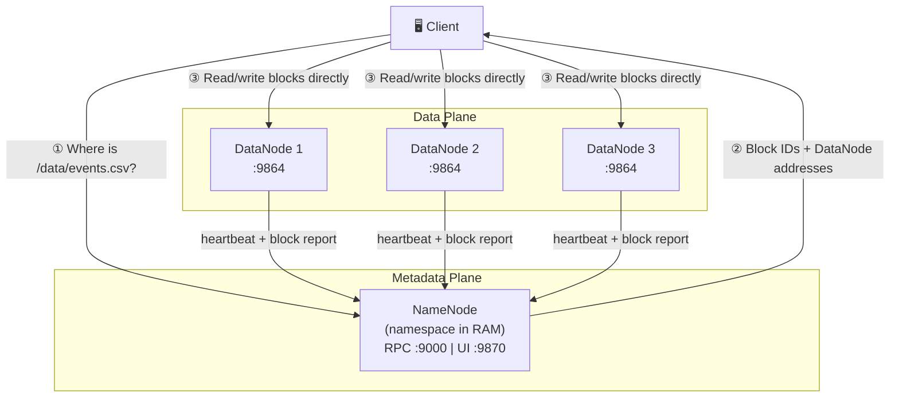

# HDFS Architecture

## Overview

HDFS (Hadoop Distributed File System) is a distributed filesystem built for storing large files across commodity hardware. It follows a **write-once-read-many** model — optimized for batch throughput, not low-latency random access. A single logical filesystem spans hundreds of machines, with fault tolerance built into the storage layer.

---

## Core Components

| Component | Stores | Does |
|---|---|---|
| **NameNode** | Full namespace (inode tree) **in RAM** | Manages metadata: file paths, block locations, permissions |
| **DataNode** | Actual data blocks on local disk | Serves read/write requests; sends heartbeat every 3s |
| **Secondary NameNode** | Periodic fsimage snapshots | Merges fsimage + edit log to bound recovery time — **NOT a hot standby** |
| **Client** | Nothing | Talks to NameNode for metadata, then directly to DataNodes for data |

> **Critical:** The Secondary NameNode does not take over if the NameNode crashes. It only performs checkpointing to reduce startup time after a failure.

---

## Two-Plane Architecture

HDFS separates **metadata** from **data** into two distinct communication planes.



**Key insight:** The NameNode never touches file data. All data transfer is directly between the client and DataNodes. The NameNode is purely a metadata server.

---

## NameNode RAM Bottleneck

Every file, directory, and block takes ~150 bytes in NameNode RAM. This means:

- 1 billion files ≈ 150 GB RAM on the NameNode
- Millions of small files exhaust NameNode memory faster than storage
- Large block sizes (128 MB default) exist partly to reduce the number of blocks tracked

---

## Port Reference

| Port | Service |
|---|---|
| `9000` | NameNode RPC (client connections) |
| `9870` | NameNode Web UI + WebHDFS REST API |
| `9864` | DataNode RPC |
| `9866` | DataNode data transfer |

---

## Project Config

In this bootcamp setup (`hadoop-config/core-site.xml`):

```xml
<property>
    <name>fs.defaultFS</name>
    <value>hdfs://namenode:9000</value>
</property>
```

The client entry point is `hdfs://namenode:9000`. All HDFS paths resolve against this URI.
