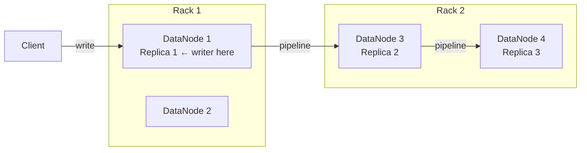
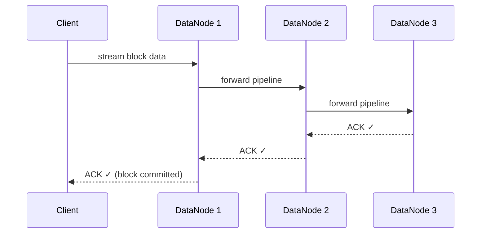

# Blocks and Replication

## Overview

HDFS splits every file into fixed-size **blocks** and stores multiple copies of each block across DataNodes. This gives you both the ability to store files larger than any single disk and automatic fault tolerance if a machine dies.

---

## Block Storage

The default block size is **128 MB** (Hadoop 2+). A file is split into as many blocks as needed; the last block is **not padded** — it only uses the space it needs.

```
File: events.csv  (300 MB)

  Block 1 ──── 128 MB ──── DataNode A, B, C
  Block 2 ──── 128 MB ──── DataNode B, D, A
  Block 3 ────  44 MB ──── DataNode C, A, D
```

**Why large blocks?** Each block is a metadata entry in the NameNode's RAM. Fewer, larger blocks = less NameNode memory pressure.

---

## Rack-Aware Replication Placement

With the default replication factor of **3**, HDFS uses a rack-aware policy to survive both node and rack failures:



**Placement rule:**
1. Replica 1 — same node as the writer (or random if remote client)
2. Replica 2 — different rack
3. Replica 3 — same rack as replica 2, different node

**Why:** One full rack going offline must not lose all copies of a block.

---

## Replication Pipeline & Acknowledgment

Writes flow through a **pipeline** — the client streams to DN1, DN1 forwards to DN2, DN2 forwards to DN3. ACKs travel back in reverse order.



The block is only considered **committed** once all replicas acknowledge.

---

## Under-Replication & Recovery

The NameNode continuously monitors block health via DataNode heartbeats. If a node goes down:

- NameNode detects missing replicas (within ~10 minutes by default)
- Schedules re-replication on other DataNodes automatically
- No operator intervention needed

Run `hdfs fsck /` to inspect replication health across the cluster.

---

## Project Config

This bootcamp uses a single-node setup (`hadoop-config/hdfs-site.xml`):

```xml
<property>
    <name>dfs.replication</name>
    <value>1</value>
</property>
```

`dfs.replication=1` is correct for a single DataNode — there are no other nodes to replicate to. In production, the default is `3`.

---

## Key Tuning Properties

| Property | Default | Effect |
|---|---|---|
| `dfs.blocksize` | `134217728` (128 MB) | Block size for new files |
| `dfs.replication` | `3` | Number of replicas per block |
| `dfs.replication.min` | `1` | Minimum replicas before write succeeds |

Set replication per-file: `hdfs dfs -setrep 2 /data/events.csv`
