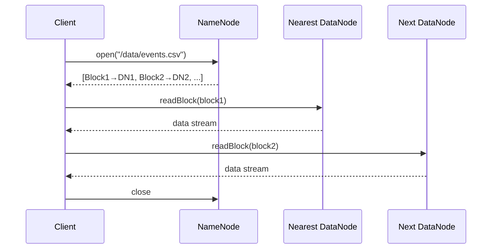
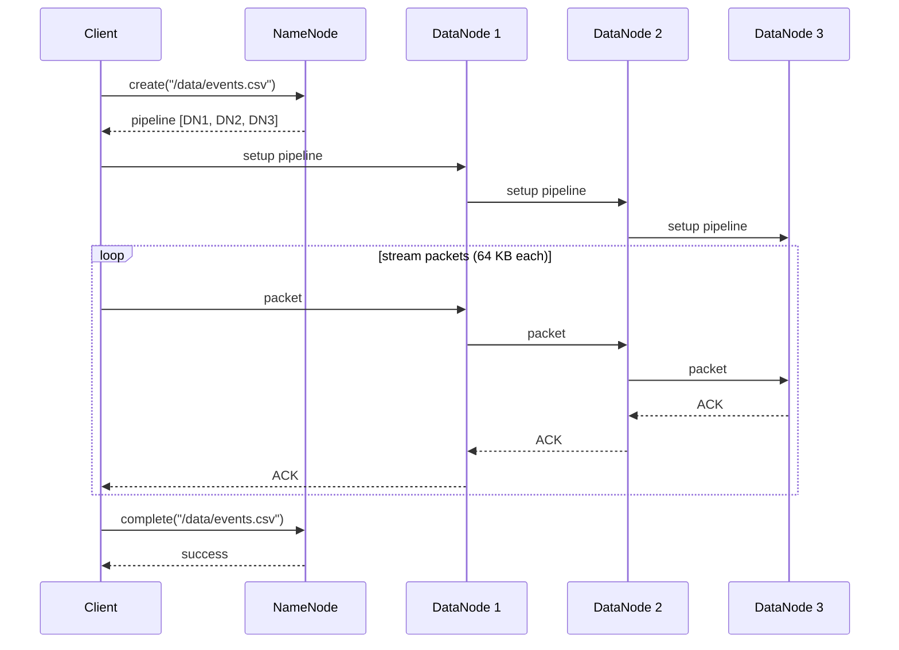

# Read and Write Paths

## Overview

HDFS clients always talk to the NameNode for **metadata only** — the actual data moves directly between the client and DataNodes. Understanding this two-phase pattern explains HDFS performance characteristics and failure modes.

---

## Read Path

**Steps:**
1. Client calls `open(path)` on the NameNode
2. NameNode returns the list of blocks and the DataNode address for each (sorted nearest-first)
3. Client connects to the **nearest** DataNode for block 1
4. DataNode streams the block to the client
5. Client moves to the next DataNode for block 2 (re-checking with NameNode if needed)
6. Client calls `close()`

**Locality optimization:** The client library picks the replica in order: same node → same rack → remote. Co-located Spark executors read at memory speed via short-circuit reads (`dfs.client.read.shortcircuit=true`).

---

## Write Path

**Steps:**
1. Client calls `create(path)` on the NameNode
2. NameNode allocates block IDs and selects a DataNode pipeline (rack-aware)
3. Client establishes the pipeline: connects to DN1, DN1 connects to DN2, DN2 to DN3
4. Client streams data in 64 KB packets through the pipeline
5. Each packet propagates DN1 → DN2 → DN3, ACKs flow back
6. Once a block is full, client requests a new block from NameNode
7. Client calls `complete()` — NameNode commits the file

---

## Fault Tolerance During Write

If a DataNode fails mid-write:

1. Pipeline is torn down
2. Good DataNodes get a new block ID (to identify the incomplete replica)
3. NameNode schedules re-replication on a different node
4. Write resumes with a new pipeline — the client is not notified unless all replicas fail

This is transparent to the application.

---

## HDFS Is Not POSIX

| POSIX | HDFS |
|---|---|
| Random write | Not supported |
| Append | Supported (HDFS 2+) |
| Truncate | Not supported |
| Multiple writers | Not supported |
| Rename | Atomic metadata operation |

HDFS is designed for **streaming reads of large files** — not transactional file access.
