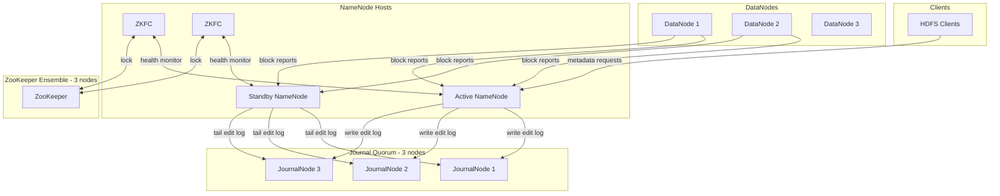
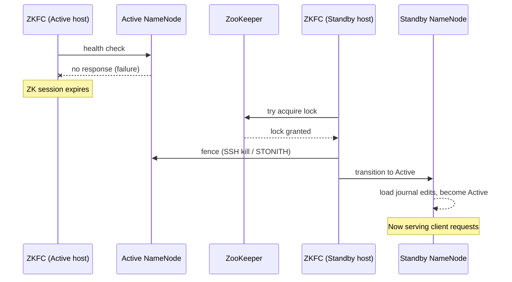

# High Availability

## Overview

In a basic HDFS setup, the NameNode is a **single point of failure** — if it goes down, the entire cluster becomes unavailable. HA mode eliminates this with an Active/Standby NameNode pair that automatically fails over in seconds.

---

## HA Architecture



---

## Key Components

### JournalNodes
- The Active NameNode writes every edit to a **quorum** of JournalNodes before acknowledging the client
- The Standby NameNode continuously **tails** the journal to stay in sync (warm standby)
- Quorum write requires `N/2 + 1` nodes — 3 JNs can tolerate 1 failure
- JournalNodes replace the older shared NFS approach

### ZKFC (ZooKeeper Failover Controller)
- Runs as a separate process on each NameNode host
- Monitors NameNode health with periodic health checks
- Holds a ZooKeeper ephemeral lock — only the Active NN's ZKFC holds the lock
- When Active NN fails, the ZKFC session expires, Standby ZKFC acquires the lock and triggers failover

### Fencing
- **Mandatory** — prevents split-brain where both NNs think they are Active
- Before Standby becomes Active, the old Active is **fenced** (killed via SSH command or STONITH)
- Without fencing, two Active NNs could corrupt the namespace

---

## Failover Sequence



---

## Minimum HA Requirements

| Component | Minimum Count | Why |
|---|---|---|
| NameNodes | 2 | Active + Standby |
| JournalNodes | 3 | Tolerate 1 JN failure |
| ZooKeeper nodes | 3 | Tolerate 1 ZK failure |
| DataNodes | 1+ | Unchanged |

---

## Manual Failover

```bash
# Graceful switchover (e.g. for maintenance)
hdfs haadmin -failover nn1 nn2

# Check status of both NameNodes
hdfs haadmin -getServiceState nn1
hdfs haadmin -getServiceState nn2
```

---

## Key Configuration Properties

```xml
<!-- hdfs-site.xml (HA config) -->
<property>
    <name>dfs.nameservices</name>
    <value>mycluster</value>
</property>
<property>
    <name>dfs.ha.namenodes.mycluster</name>
    <value>nn1,nn2</value>
</property>
<property>
    <name>dfs.ha.automatic-failover.enabled</name>
    <value>true</value>
</property>
<property>
    <name>dfs.ha.fencing.methods</name>
    <value>sshfence</value>
</property>
```

> This bootcamp runs a **non-HA single NameNode** (`hadoop-config/hdfs-site.xml`). HA is a production concern — understand it for architecture interviews and production deployments.
