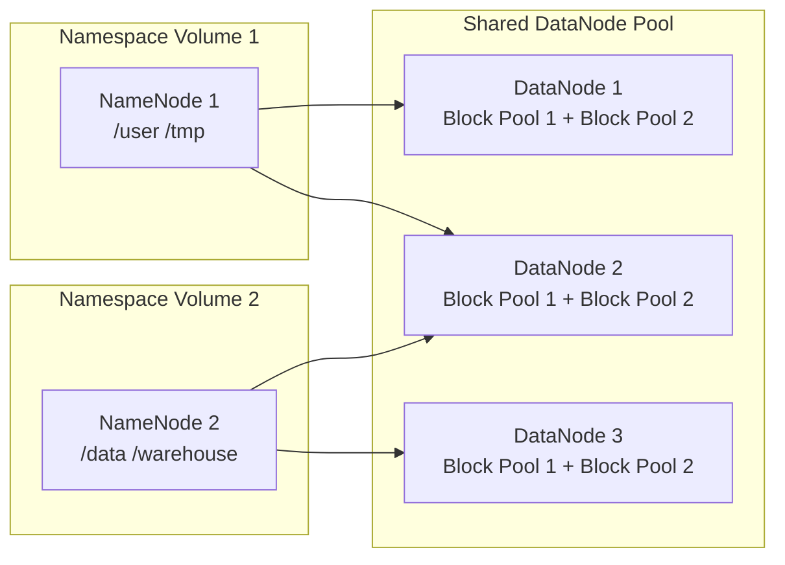

# Federation, CLI, and WebHDFS

## Overview

This document covers three things:
1. **Federation** — how to scale HDFS beyond a single NameNode's memory limit
2. **CLI** — the `hdfs dfs` commands you'll use day-to-day
3. **WebHDFS** — how to talk to HDFS over HTTP (useful for non-Java apps)

---

## HDFS Federation

### The Problem It Solves

Every file and folder in HDFS is tracked by the **NameNode** in RAM. The more files you have, the more RAM you need. A single NameNode can track roughly 100–150 million files — after that, you hit a wall.

**Federation** is the solution: instead of one big NameNode, you split the namespace across multiple NameNodes. Each NameNode owns a slice of the directory tree, but they all share the same DataNodes (the machines that actually store the data).

Think of it like a library with multiple catalog desks:
- Desk 1 knows where all the fiction books are (`/user`, `/tmp`)
- Desk 2 knows where all the non-fiction books are (`/data`, `/warehouse`)
- But the actual bookshelves (DataNodes) are shared by both desks



### Key Points

- Each NameNode is **completely independent** — they don't talk to each other
- Each DataNode registers with **all** NameNodes and keeps a separate block pool for each
- A **block pool** is just a labeled bucket of blocks on the DataNode — one per NameNode it serves

### How Clients Know Which NameNode to Ask

Clients use **ViewFS** — a virtual filesystem layer that maps path prefixes to the right NameNode. You configure this in `core-site.xml`:

```xml
<!-- core-site.xml — ViewFS mount table -->
<!-- When a client accesses /user/..., route it to NameNode 1 -->
<property>
    <name>fs.viewfs.mounttable.default.link./user</name>
    <value>hdfs://nn1:9000/user</value>
</property>

<!-- When a client accesses /data/..., route it to NameNode 2 -->
<property>
    <name>fs.viewfs.mounttable.default.link./data</name>
    <value>hdfs://nn2:9000/data</value>
</property>
```

The client just uses `viewfs:///user/...` or `viewfs:///data/...` and ViewFS handles the routing — no need to know which NameNode is responsible.

---

## HDFS CLI

The `hdfs dfs` command is your main tool for working with files in HDFS. The syntax is very similar to standard Unix commands (`ls`, `mkdir`, `mv`, etc.).

### File Operations (`hdfs dfs`)

```bash
# --- Listing ---
hdfs dfs -ls /data                    # list files and folders in /data
hdfs dfs -ls -R /data                 # list everything recursively (like find)

# --- Uploading & Downloading ---
hdfs dfs -put local.csv /data/        # upload local.csv from your machine to HDFS
hdfs dfs -get /data/events.csv .      # download events.csv from HDFS to current directory
hdfs dfs -cat /data/events.csv        # print file contents to the terminal (like Unix cat)

# --- Managing Files and Directories ---
hdfs dfs -mkdir -p /data/2024/events  # create directory (and parent dirs) — like mkdir -p
hdfs dfs -mv /data/old /data/new      # rename or move a file/directory
hdfs dfs -rm -r /data/temp            # delete a directory and everything inside it
hdfs dfs -cp /data/a /data/b          # copy a file within HDFS

# --- Inspecting Files ---
hdfs dfs -du -s -h /data              # show total disk usage of /data in human-readable format
hdfs dfs -stat "%b %r %n" /data/file  # show block size (%b), replication factor (%r), name (%n)
hdfs dfs -setrep 2 /data/events.csv   # change how many copies HDFS keeps of this file
```

> **Replication factor** = how many copies of each data block HDFS stores across DataNodes.
> Default is 3. Lower it to save space; raise it for files you can't afford to lose.

### Admin Operations (`hdfs dfsadmin`)

These commands are for checking and managing the cluster itself, not individual files:

```bash
hdfs dfsadmin -report           # show cluster summary: total capacity, free space, live/dead nodes
hdfs dfsadmin -safemode get     # check if cluster is in safe mode (read-only startup mode)
hdfs dfsadmin -refreshNodes     # tell the NameNode to re-read its list of allowed DataNodes
```

> **Safe mode** is a temporary read-only state that HDFS enters on startup while it verifies
> that enough block replicas are available. It exits automatically once checks pass.

### Diagnostics

```bash
hdfs fsck /                                          # scan the entire filesystem for corrupt/missing blocks
hdfs fsck /data/events.csv -files -blocks -locations # show exactly which DataNodes hold each block of a file
hdfs balancer -threshold 10                          # move blocks around so no DataNode is more than 10% more full than average
```

> **fsck** (filesystem check) is your go-to when you suspect data loss or corruption.
> **balancer** is useful after adding new DataNodes — data doesn't automatically redistribute itself.

---

## WebHDFS REST API

WebHDFS lets you talk to HDFS over plain HTTP using `curl`, a browser, or any HTTP client. This is especially useful when you're working in Python, Go, or any non-JVM language.

### Enabling It

Make sure this is set in `hadoop-config/hdfs-site.xml` (it's already enabled in this project):

```xml
<property>
    <name>dfs.webhdfs.enabled</name>
    <value>true</value>
</property>
```

### Base URL

All WebHDFS calls go to: `http://namenode:9870/webhdfs/v1`

You append the HDFS path and an `?op=OPERATION` query parameter.

### Common Operations

```bash
# List files in a directory
curl "http://namenode:9870/webhdfs/v1/data?op=LISTSTATUS"

# Read a file
# The -L flag follows the redirect to the DataNode that holds the data
curl -L "http://namenode:9870/webhdfs/v1/data/events.csv?op=OPEN"

# Upload a file (this is a two-step process — see note below)
curl -i -X PUT "http://namenode:9870/webhdfs/v1/data/upload.csv?op=CREATE"
# → copy the URL from the "Location:" header in the response, then:
curl -X PUT -T upload.csv "<Location URL from above>"

# Delete a file
curl -X DELETE "http://namenode:9870/webhdfs/v1/data/old.csv?op=DELETE"

# Create a directory
curl -X PUT "http://namenode:9870/webhdfs/v1/data/2024?op=MKDIRS"

# Get metadata about a file (size, permissions, modification time, etc.)
curl "http://namenode:9870/webhdfs/v1/data/events.csv?op=GETFILESTATUS"
```

### Why Uploading Takes Two Steps

When you write a file, HDFS always streams data **directly to a DataNode** (not through the NameNode). WebHDFS mirrors this:

1. You send a `PUT` request to the NameNode
2. The NameNode responds with `307 Redirect` pointing to the right DataNode
3. You stream the file body to that DataNode URL

This keeps the NameNode out of the data path, which is the same design as the native Java client.

---

## Python Client (this project)

The project wraps WebHDFS with a thin Python client at [python/src/clickhouse_fundamentals/hdfs/client.py](python/src/clickhouse_fundamentals/hdfs/client.py).
It uses the `hdfs` Python library, which talks WebHDFS under the hood — no JVM needed.

```python
from clickhouse_fundamentals.hdfs.client import HdfsClient

with HdfsClient(host="namenode", port=9870) as client:
    client.makedirs("/data/events")                  # create directory
    client.write("/data/events/2024.csv", data)      # upload data
    content = client.read("/data/events/2024.csv")   # download data
    files = client.list("/data/events")              # list directory contents
```

---

## When to Use Which Interface

| Interface | Best For |
|---|---|
| `hdfs dfs` CLI | Quick file operations, shell scripts, debugging |
| `hdfs dfsadmin` CLI | Cluster health checks, adding/removing nodes |
| WebHDFS REST | Python/Go/JS apps, microservices, anything non-JVM |
| Java/Python SDK | Application code that needs retries and connection pooling |
