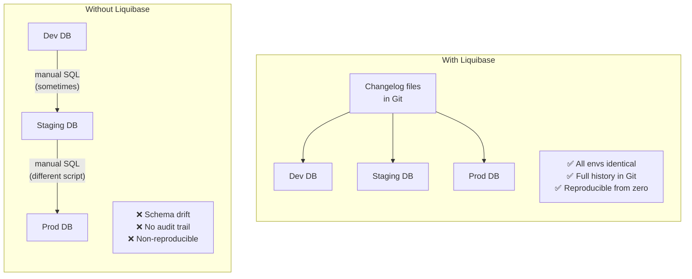
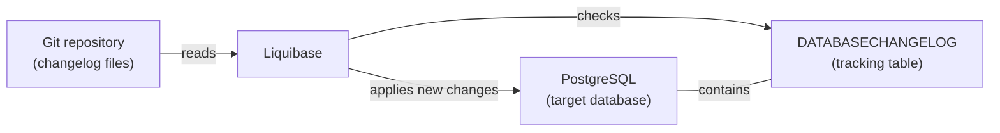

# Liquibase — What It Is and Why It Exists

## The Problem: Databases Are Hard to Version

Source code lives in Git. You can see every change, who made it, when, and why. You can roll back. You can reproduce any historical state. But databases are different — the schema (tables, columns, indexes, constraints) lives outside your codebase, and changes to it are typically applied by hand.

This causes a class of problems that every team hits:

| Problem | What happens |
|---------|-------------|
| **Schema drift** | Dev, staging, and prod evolve independently — a column exists locally but not in prod |
| **No history** | Nobody knows when `user_id` was added to `sessions`, or why |
| **Manual coordination** | "Before you deploy, remember to run this SQL…" in a Slack message |
| **Non-repeatable setup** | A new developer can clone the repo but can't recreate the exact DB state |
| **Fear of change** | Applying a migration to prod is a manual, nerve-wracking event |

## What Liquibase Is

Liquibase is an open-source **database change management** tool. Think of it as Git for your database schema.

You describe schema changes in structured files called **changelogs** (YAML, XML, or SQL). Liquibase reads those files, figures out which changes have already been applied to the target database, and runs only the new ones — in the correct order, atomically.

## Why Not Just Write SQL Scripts?

Raw SQL scripts work for a while. Then they don't:

- Which scripts have been run on prod? No one knows for certain.
- If you run a script twice, does it break? Often yes.
- How do you handle a new developer who needs to replay months of changes?

Liquibase solves all three:

1. **Tracking**: it records every applied changeset in a `DATABASECHANGELOG` table inside the database itself.
2. **Idempotency**: it skips changesets that are already applied — safe to run repeatedly.
3. **Ordered replay**: a new developer runs one command and gets the exact same schema as prod.

## What Liquibase Does NOT Do

- It does **not** manage application data migrations (use your app layer for that).
- It does **not** require a specific database — it supports PostgreSQL, MySQL, Oracle, and more via JDBC drivers.
- It does **not** replace your database backup strategy.
