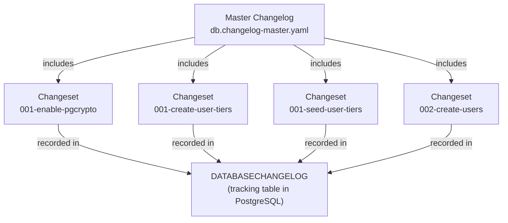
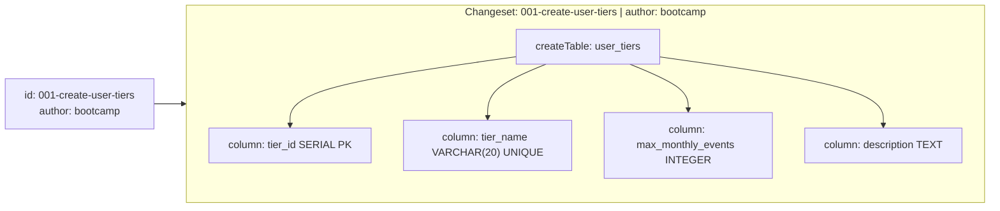
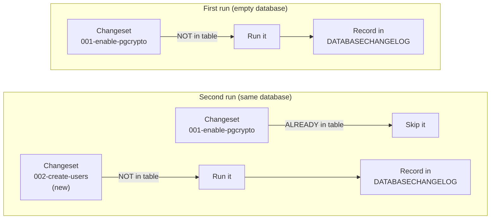

# Liquibase — Core Concepts

## The Four Building Blocks



---

## Changelog

A **changelog** is a YAML (or XML/SQL) file that lists database changes. It can either contain changesets directly, or `include` other changelog files.

In this project the master changelog just delegates to 9 individual files:

```yaml
# db.changelog-master.yaml
databaseChangeLog:
  - include:
      file: changelogs/001_create_user_tiers.yaml
  - include:
      file: changelogs/002_create_users.yaml
  # ... and so on
```

This keeps each table's history in its own file — easier to read and review.

---

## Changeset

A **changeset** is one atomic unit of change. It is the fundamental building block.

Every changeset has three required pieces:
- `id` — unique identifier within the changelog file
- `author` — who wrote it
- `changes` — the list of operations to apply



A single changeset should do one logical thing. If it fails, the whole changeset is rolled back — not just part of it.

---

## DATABASECHANGELOG

This is a table that Liquibase **automatically creates** in your target database on first run. It is the source of truth for what has been applied.

| Column | What it stores |
|--------|---------------|
| `ID` | The `id` from the changeset |
| `AUTHOR` | The `author` from the changeset |
| `FILENAME` | Which changelog file it came from |
| `DATEEXECUTED` | When it was applied |
| `ORDEREXECUTED` | Sequence number |
| `MD5SUM` | Checksum of the changeset — detects tampering |
| `EXECTYPE` | `EXECUTED`, `RERAN`, `SKIPPED` |



This is what makes Liquibase **idempotent** — you can run `liquibase update` ten times and only the unapplied changesets will execute.

---

## DATABASECHANGELOGLOCK

A second auto-created table. It holds a single lock row that Liquibase sets to `true` at the start of an update and releases when done.

This prevents two Liquibase processes from running migrations against the same database simultaneously — a critical safety net in CI/CD pipelines where multiple agents might trigger deploys at the same time.

---

## Changeset Checksums and Safety

When Liquibase records a changeset in `DATABASECHANGELOG`, it also stores an **MD5 checksum** of the changeset content.

On subsequent runs, if a changeset is found in `DATABASECHANGELOG` but its content has changed (the checksum doesn't match), Liquibase **throws an error** and stops. This prevents silent schema corruption from edited history.

> Never edit a changeset that has already been applied. Add a new changeset instead.
