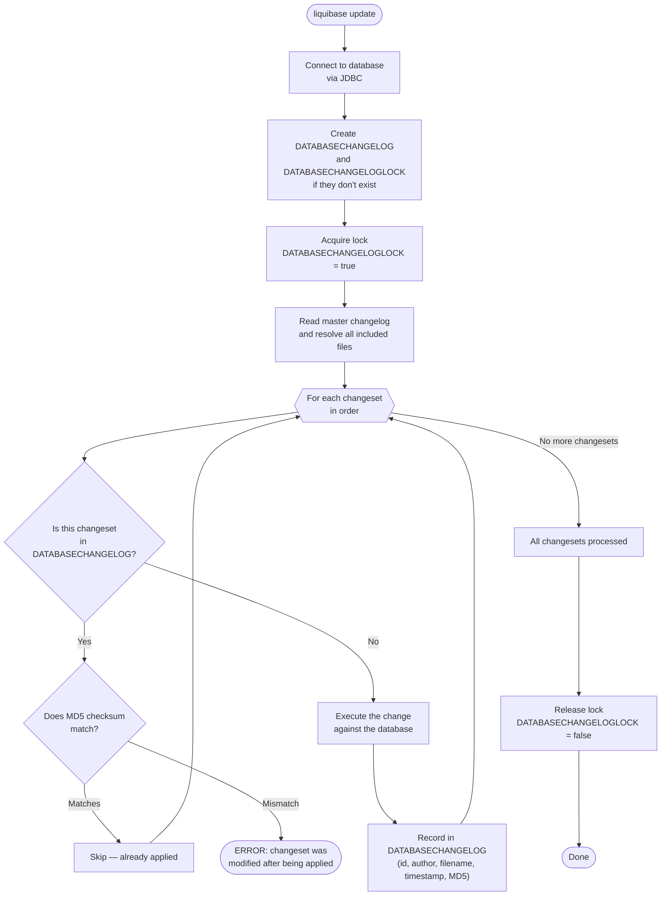
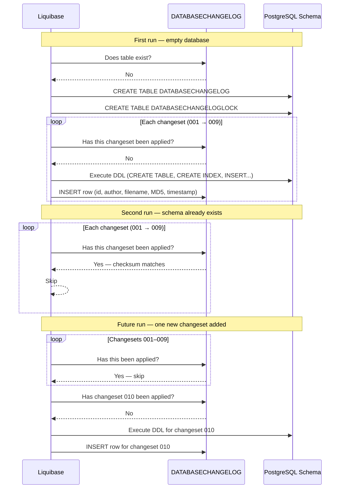

# Liquibase — Execution Flow

## What Happens When You Run `liquibase update`

The `update` command is the core operation. It brings the target database schema up to date with the changelog files.

---

## Step-by-Step Walkthrough

### 1. Connect
Liquibase connects to the database using the JDBC URL, username, and password from the environment or properties file.

### 2. Bootstrap tracking tables
On first run, it creates `DATABASECHANGELOG` and `DATABASECHANGELOGLOCK` if they don't exist. This is safe and idempotent.

### 3. Acquire lock
Sets `DATABASECHANGELOGLOCK.LOCKED = true`. If another process holds the lock, Liquibase waits or fails with a timeout error.

### 4. Walk the changelog
Reads the master changelog file, which resolves all `include` references and produces an ordered list of every changeset.

### 5. Per-changeset decision
For each changeset (in order):

| Scenario | Action |
|----------|--------|
| Not in `DATABASECHANGELOG` | Execute the changeset, then record it |
| In `DATABASECHANGELOG`, checksum matches | Skip silently |
| In `DATABASECHANGELOG`, checksum mismatch | Throw error and stop |

### 6. Record execution
After successfully applying a changeset, one row is inserted into `DATABASECHANGELOG`. This is what makes subsequent runs idempotent.

### 7. Release lock
Clears `DATABASECHANGELOGLOCK` so other processes can run.

---

## Sequence Diagram: First Run vs. Incremental Run

---

## What Can Go Wrong

| Error | Cause | Fix |
|-------|-------|-----|
| `Checksum mismatch` | An applied changeset was edited | Revert the edit; add a new changeset instead |
| `Lock held by another process` | Previous run crashed | Manually run `liquibase releaseLocks` |
| `Object already exists` | Schema was modified outside Liquibase | Add a `preconditions` guard or mark the changeset as already run |
| JDBC connection refused | PostgreSQL not up yet | Check `depends_on: condition: service_healthy` in Docker Compose |
