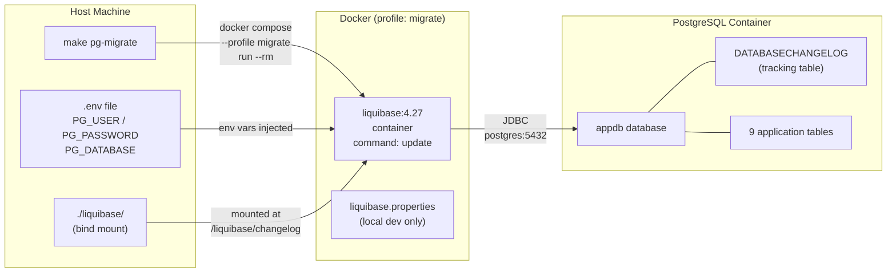
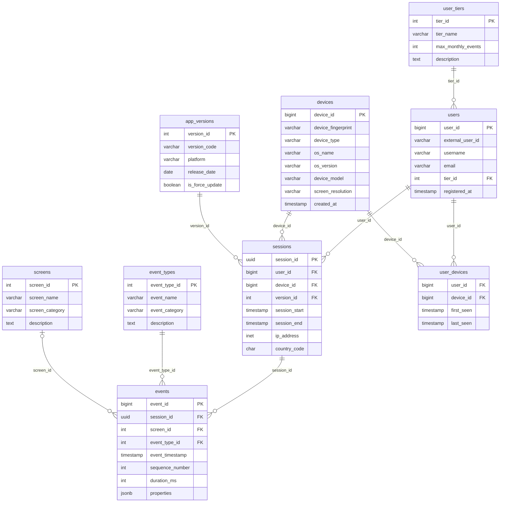
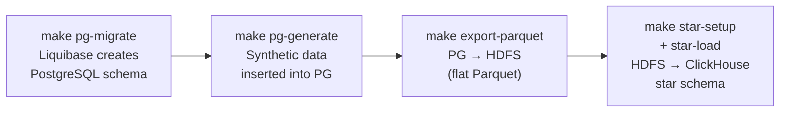

# Liquibase — Project Implementation

## How Everything Is Wired Together



### The chain, step by step

1. Developer runs `make pg-migrate`
2. Docker Compose starts a one-shot `liquibase:4.27` container (profile `migrate`)
3. The `./liquibase/` directory is bind-mounted into the container at `/liquibase/changelog`
4. Credentials from `.env` are injected as environment variables (`LIQUIBASE_COMMAND_URL`, `LIQUIBASE_COMMAND_USERNAME`, etc.)
5. The container runs `liquibase update`, connecting to `postgres:5432` (the service name inside Docker's network)
6. Liquibase applies any unapplied changesets and exits — the container is removed (`--rm`)

---

## Directory Layout

```
liquibase/
├── liquibase.properties              ← local dev config (JDBC URL, credentials)
└── changelogs/
    ├── db.changelog-master.yaml      ← master file, includes all others in order
    ├── 001_create_user_tiers.yaml
    ├── 002_create_users.yaml
    ├── 003_create_devices.yaml
    ├── 004_create_app_versions.yaml
    ├── 005_create_screens.yaml
    ├── 006_create_event_types.yaml
    ├── 007_create_sessions.yaml
    ├── 008_create_events.yaml
    └── 009_create_user_devices.yaml
```

The numbering enforces dependency order — `users` must exist before `sessions` (which has a FK to `users`).

---

## Anatomy of a Real Changeset

From `001_create_user_tiers.yaml`:

```yaml
databaseChangeLog:
  - changeSet:
      id: 001-enable-pgcrypto          # unique within this file
      author: bootcamp
      changes:
        - sql:
            sql: CREATE EXTENSION IF NOT EXISTS pgcrypto;   # raw SQL fallback

  - changeSet:
      id: 001-create-user-tiers        # descriptive, not just a number
      author: bootcamp
      changes:
        - createTable:
            tableName: user_tiers
            columns:
              - column:
                  name: tier_id
                  type: SERIAL
                  constraints:
                    primaryKey: true
                    primaryKeyName: pk_user_tiers
              - column:
                  name: tier_name
                  type: VARCHAR(20)
                  constraints:
                    nullable: false
                    unique: true
                    uniqueConstraintName: uq_user_tiers_name

  - changeSet:
      id: 001-seed-user-tiers          # seed data is its own changeset
      author: bootcamp
      changes:
        - insert:
            tableName: user_tiers
            columns:
              - column: { name: tier_name, value: free }
              - column: { name: max_monthly_events, valueNumeric: 1000 }
```

Three changesets per file here: enable extension → create table → seed reference data. Each is atomic and independently tracked.

---

## The 9-Table Schema

All 9 tables are created by the changelogs. This is the PostgreSQL 3NF source schema for the mobile app interaction data pipeline.



### Design decisions embedded in the schema

| Decision | Why |
|----------|-----|
| `country_code` on `sessions`, not `users` | A user's location is session-specific — they may travel |
| `duration_seconds` not stored on `sessions` | Derived from `session_end - session_start`; storing it would duplicate data |
| `screen_id` is nullable on `events` | Some events are not tied to a screen (e.g., background sync events) |
| `properties JSONB` on `events` | Flexible event payload without schema changes for every new event attribute |
| `device_fingerprint` unique on `devices` | One physical device = one row, regardless of how many users share it |
| UUID for `session_id` | Sessions can be generated client-side without a DB round-trip |

---

## Running Migrations

```bash
# 1. Start PostgreSQL (if not already running)
make pg-up

# 2. Apply all pending migrations
make pg-migrate
```

`make pg-migrate` expands to:
```bash
docker compose --profile migrate run --rm --no-deps liquibase
```

- `--profile migrate` — opt-in profile; the Liquibase service doesn't start unless requested
- `run --rm` — one-shot container, removed after exit
- `--no-deps` — don't try to start postgres again (it's already healthy)

On first run: all 9 changelogs execute, ~15 changesets applied.
On subsequent runs: all changesets skipped, exits in under a second.

---

## Where This Fits in the Full Pipeline

Liquibase runs **once, at setup time**. The rest of the pipeline builds on top of the schema it creates.


